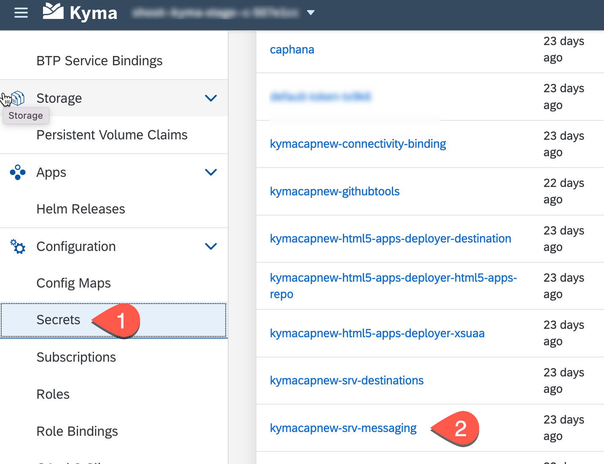

# Configure Event-Based Communication Between SAP S/4HANA and SAP Event Mesh
## Introduction

In this how-to guide, you will establish a connection between your SAP S/4HANA on-premise system and SAP Event Mesh. This connection is needed to transport events from the SAP S/4HANA system to SAP Event Mesh.

See section [Creating RFC Destination](https://help.sap.com/docs/r/810dfd34f2cc4f39aa8d946b5204fd9c/1809.000/en-US/12559a8c26f34e0bbe8c6d82b7501424.html) on SAP Help Portal on how to configure trust and create the RFC destination.

### Configure Endpoint

1. Open your browser and navigate to your subaccount in SAP BTP Cockpit.

2. Navigate to **Overview** and click on **consoleURL** under **Kyma**.

3. On the Kyma Console, navigate to your **namespace** and then to **secrets**.

    

4. Choose **decode secret** and copy the respective values to the `event-mesh-template.json` file under the root directory of your project.

 ### Configure Channel

 1. Open your SAP S/4HANA system and navigate to the transaction **/IWXBE/CONFIG**.

 2. Choose **via Service Key**.

 

 3. In the popup, choose a **channel name**, for example, 'S4EM', provide a description and paste the **Service Key** you have created in the earlier steps using `event-mesh-template.json` file.

 4. Choose **save configuration**.

  

 5. After your configuration is saved, choose **Activate - Deactivate**.

 6. Choose **Check connection**.

 7. Choose **Outbound Bindings** to start the configuration.

  

 8. In the next screen, choose **Create** &rarr; **Topic** and choose: "BusinessPartner/created/V1" and "BusinessPartner/changed/V1".

 
