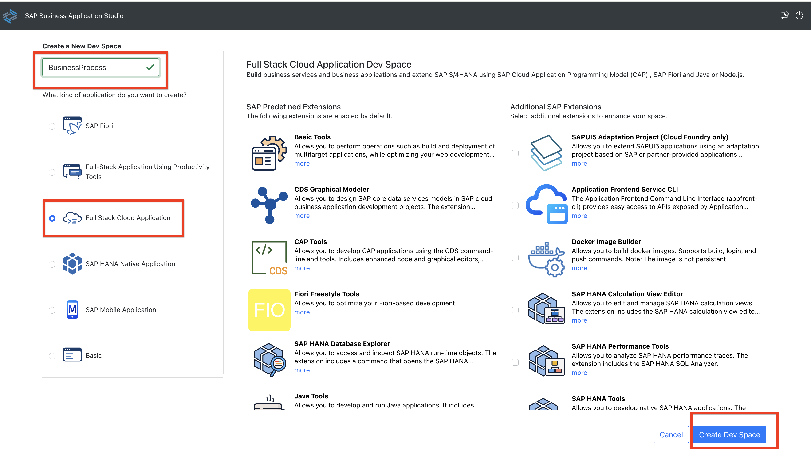
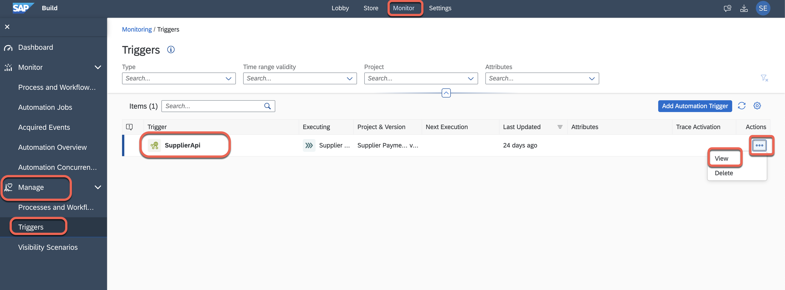
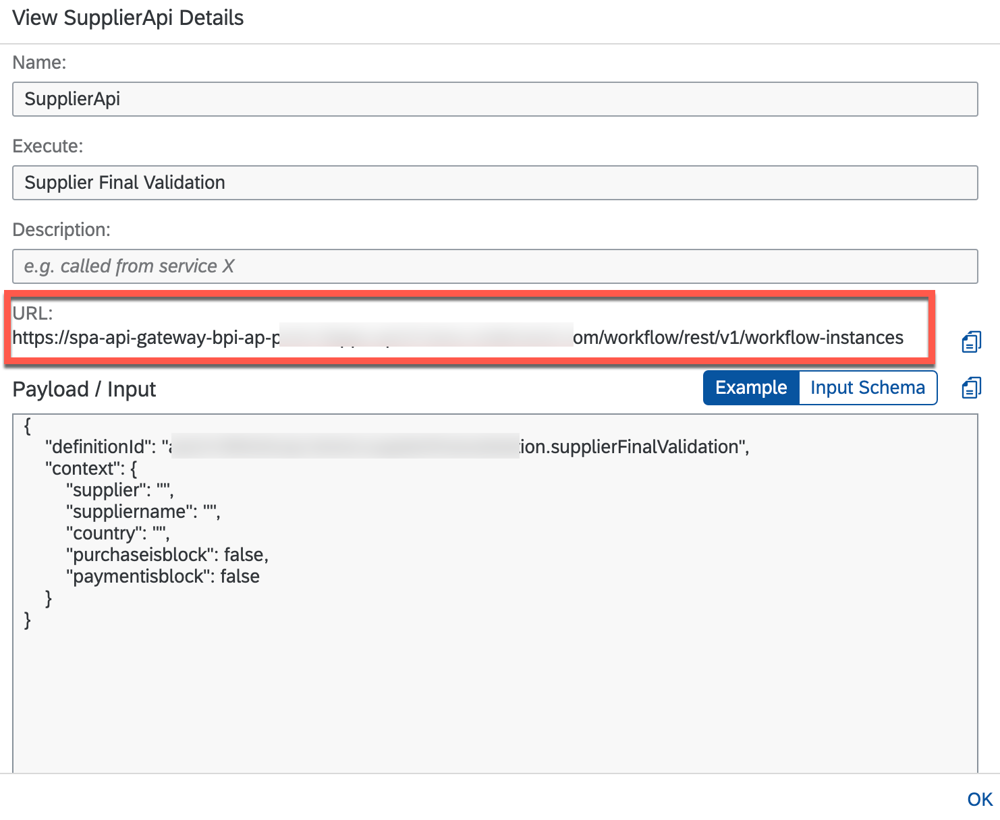
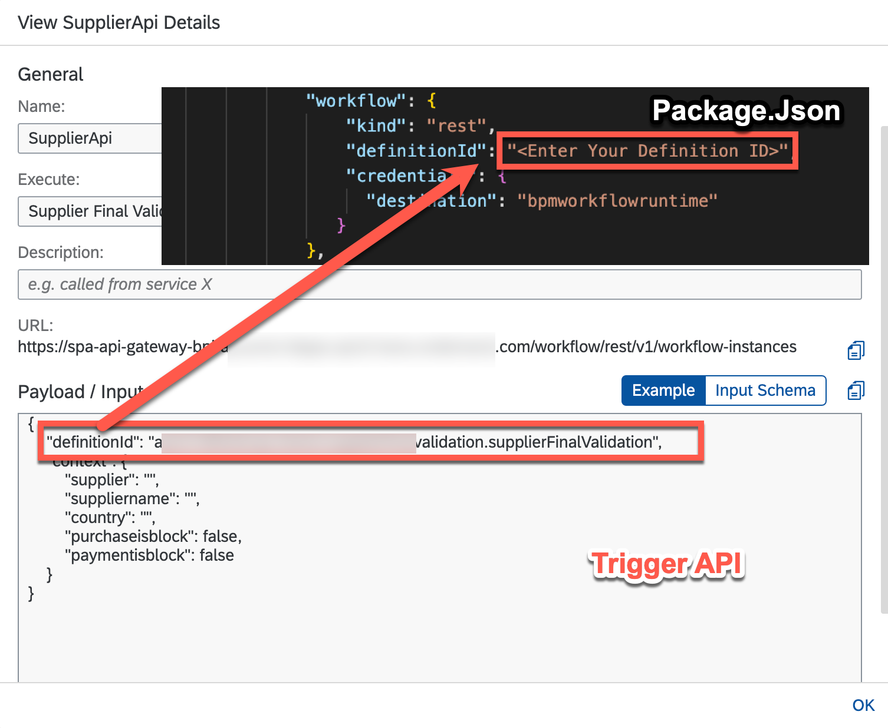
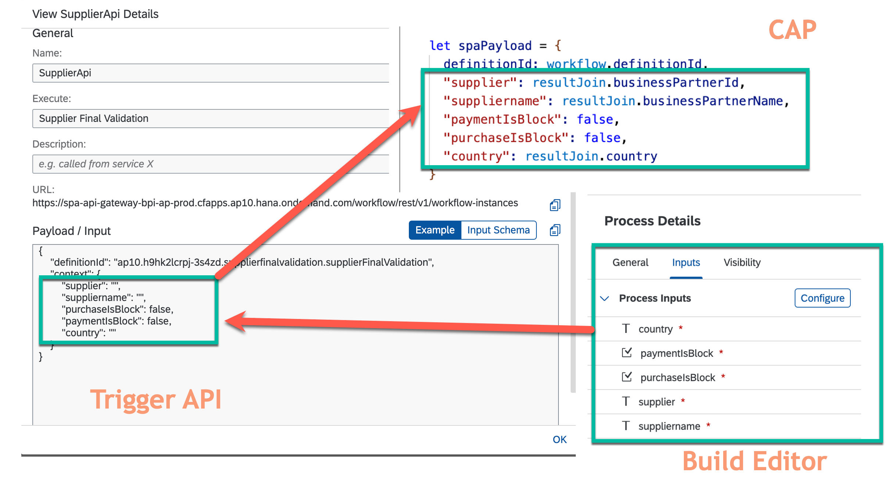

# Deploy the SAP Cloud Application Programming Model Application

## Introduction

Now we will setup the SAP Business Application Studio and use it to develop our . You will also create a linkage between SAP Cloud Application Programming Model (CAP) application and SAP Build Process Automation.

**Persona:** BTP Developer

### Create a New Application in SAP Business Application Studio

1.	Make sure you have opened your *SAP BTP Account* and navigate to your *Subaccount* 
   
2.	Open the menu *Services* and navigate to *Instances and Subscriptions*
   
3.	Choose "SAP Business Application Studio" under the *Subscriptions* tab and click on the icon to open the application
     
     
 
4.	 After opening the home sceen of SAP Business Application Studio, click the button *Create Dev Space*

     
 
5.	On the next screen, you will create the new Dev Space. For this enter a Dev space name e.g 'BusinessProcess', select the type *Full Stack Cloud Application*.
    Don´t forget to click on the button *Create Dev Space*

      
      
 
6.	Your Dev Space is now being created. As soon as the Dev Space is running, you can click on your Dev Spaces name to access

7.	Choose *Terminal -> New Terminal* in the menu on the top of your screen.

    
 
8. In the opened terminal go to projects folder with executing
   
   ``` 
   cd projects
   ``` 
 
9.	 Then clone the project from your personal GitHub and enter username and token to execute the command: 
   ``` 
   git clone https://github.com/SAP-samples/s4hana-cloud-extension-process-automation.git
   ``` 
 
10.	Click on *File* in the menu on the top and choose *Open Workspace* in the drop-down.

    
 
11.	 Open the project by selecting projects -> s4hana-cloud-extension-process-automation and click on *Open*

### Create a Linkage between SAP Cloud Application Programming Model (CAP) Application and SAP Build Process Automation

1. Open SAP Build and choose **Monitor** > **Manage** > **Triggers** > choose **SupplierApi** > choose **Actions** > choose **View**.

   

2. In the **View SupplierApi Details** dialog box, copy the **definitionId**.

  

3. Open your CAP application and choose file package.json.

4. Enter the definitionId under cds > requires > workflow > definitionId.

  

5. Open file srv > service.js and review the spaPayload structure to make sure there is sync between trigger api json and spaPayload json.

  

> TROUBLESHOOT: If there is any mismatch between trigger api and CAP spaPayload json, then you have to change it from SAP Build Editor by choosing **Configure**. Once you fix it, then you have to deploy again to reflect the changes in Trigger API.

6. For the next steps, you need the terminal again. Go to *Terminal* -> *New Terminal*.

### Deploy SAP Cloud Application Programming Model (CAP) Application
     
1. you need to login to your Cloud Foundry account from SAP Business Application Studio:
 
   * Check if you are logged in to your account in SAP BTP from **SAP Business Application Studio**.
   
   * You can find the API endpoint of your region by switching into your subaccount in the SAP BTP cockpit that you should have opened in another browser tab and copy the API Endpoint. Write down the **Org Name** into a text editor of your choice which is needed for the next step.  

     
    
   * Choose **Spaces** and write down the space name to a text editor of your choice. 

     
     
   * Back in Business Application Studi- to log in to Cloud Foundry, choose **View** > **Find Command**.
    
   * Search for **CF Login**.
    
   * Choose **CF: Login on to Cloud Foundry**.

      
    
      * Enter CF API endpoint which you copied or take the default suggested API endpoint.     
   * Enter your SAP BTP account **Email** and **Password**.

       
   
   * Select your Cloud Foundry **Org** which you have noted down. 
   * Select the space name which you have noted down. Once you have selected the Org and Space, you would login to Cloud Foundry in SAP Business Application Studio.
   * Now we have successfully created a workspace and pointed to our desired SAP BTP **Org** and **Space**.

      

2. For **SAP BTP Trial only**:
>  Open the em.json file and replace the content to the following to work with the SAP Event Mesh service (dev plan). Change \<emname\> to a meaningful value, for example, eccevent.
>
>   ```json
>   { "emname": "<emname>",
>     "options": {
>       "management": true,
>       "messagingrest": true,
>       "messaging": true
>   }
> }
> ```
 
> **SAP BTP Trial only:**: Open srv >service.js file and search for messaging.on. Replace the topic name (refappscf/ecc/123/BO/BusinessPartner/Changed) with the customized one.
> Ex:- \<emname\>/BO/BusinessPartner/Created and \<emname\>/BO/BusinessPartner/Changed
        
> **SAP BTP Trial only:** In the mta.yml file, change the service plan name to dev for BusinessPartnerValidation-ems
>```
>  - name: BusinessPartnerValidation-ems
>    parameters:
>    path: ./em.json 
>    service: enterprise-messaging
>    service-plan: default
> type: org.cloudfoundry.managed-service 
> ```

3. Generate the MTAR file. Alternatively, you can also right-click on **mta.yaml** file in the Explorer view and select **Build MTA Project** to build the project.
    
    ```bash
      mbt build -p=cf
    ```

4. Deploy the application to your Cloud Foundry space with the MTAR. Alternatively, You can expand the folder **mta\_archives** in Explorer view and right-click on file **BusinessPartnerValidation\_1.0.0.mtar** and choose **Deploy MTA Archive**.

    ```bash
       cf deploy mta_archives/BusinessPartnerValidation_1.0.0.mtar
    ```
    
5. Generate a service key for configuring event communication between SAP system and SAP Event Mesh.
   
    ```bash
       cf create-service-key BusinessPartnerValidation-ems emkey
    ```
    
6. Check if the deployment finished successfully without giving any errors.

### Test your application

1. Go to the terminal and enter *cf apps*.

 


2. Copy the URL of the app BusinessPartnerValidation-srv and open it in a new browser tab.

 

3. You can see that the service is deployed and is running. You cannot test or access the data and you will get authorization error (which is fine).

### Summary
You have done the configuration for the reference application. You also created the service instances for the required services and deployed the application to your Cloud Foundry space in SAP BTP. In the next steps, you will configure the eventing on the cloud and on-premise and then you are ready to run the application.