### Run the Business Process

1. Open the **Supplier Approval for SAP S/4HANA** process builder of the **Deployed** version, and choose **Supplier Request Form** to get the form URL which can be directly opened from the web browser.

    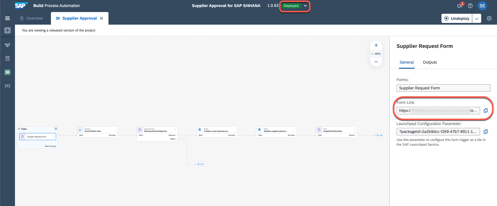

2. When you open the form in the browser, you will have all the input fields as you have defined in the process trigger form. Fill in the form and choose **Submit**.

    

### Monitor the Process Flow

Monitoring business process is one of the key aspect of the automated processes. Technical monitoring is an administrator job where a process admin proactively and consistently monitors the process performance, identifies any issues in the process and takes necessary actions to ensure business process continuity.

**SAP Build** provides different applications to monitor and manage different process artefacts. These applications are available in the **Monitor** tab.

1. Choose **Home** and then choose **Monitor**.

    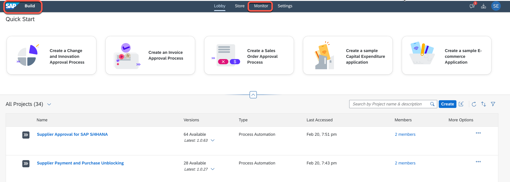

2. All deployed processes can be accessed under Processes and Workflows under Manage. To monitor all the running instances of the process, you have to go to **Monitor then Process and Workflow Instances**.

    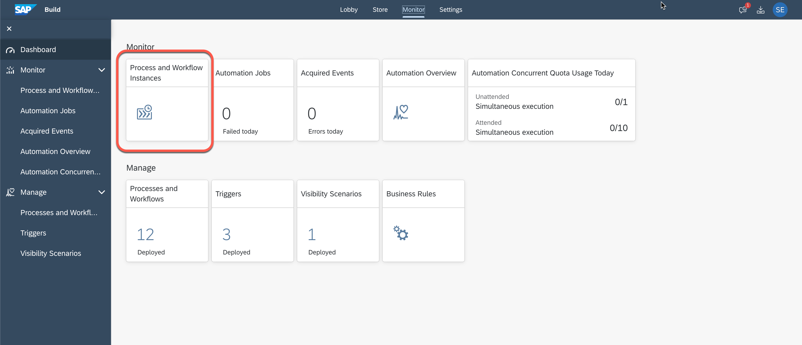

3. In there, you will see all the running, erroneous and suspended process instances. Use the filter bar to get a more customized view of the process instances based on different statutes like running, completed, suspended, terminated and so on. Choose your process instance that was just triggered via the start form. As you can see the process is waiting for the task to be completed. 

    

4. As you can see the process is waiting for the task to be completed. These tasks are generated from the forms that are added in the process and can be accessed via the **My Inbox** application.

    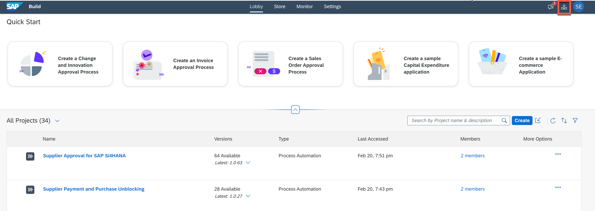

### Access the Supplier Approval Tasks

Tasks are the request for the users to participate in an approval or review process. These tasks appear in the **My Inbox** application shipped with SAP Build. Users can claim, approve and reject the task from their inbox.

1. Choose **Approve**.

    

2. Once you **approve/reject** the approval task, **refresh** the inbox again to get the final notification based on action taken. This notification contains the **Supplier ID** which is created in SAP S/4HANA. Once you acknowledge the notification sent via the approval process, the process will be completed. Choose **Submit** to acknowledge.

    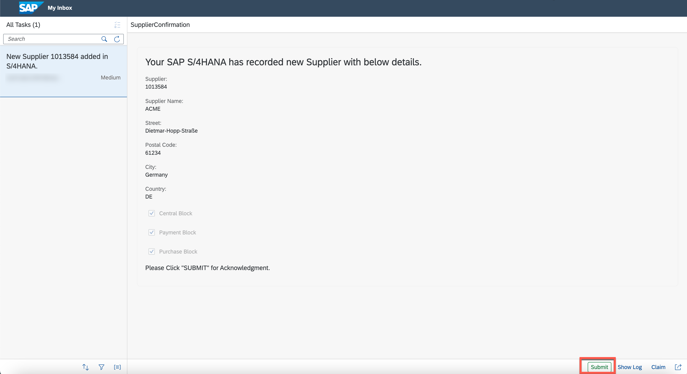

### Verify Supplier in SAP S/4HANA

1. Open SAP S/4HANA GUI and enter transaction **BP**. Enter your **Supplier ID** which you received in a notification form.

2. In the **Display in BP role** field, choose **Supplier**. Verify the **name** and **address**.

    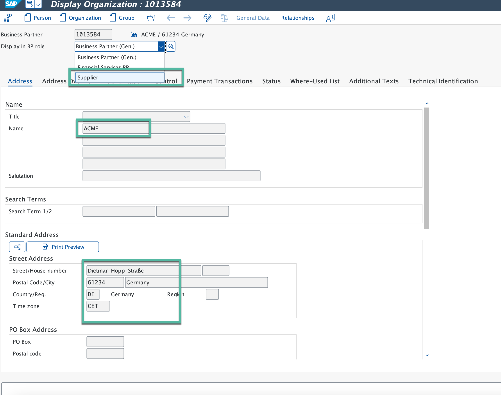

3. Choose **Status**. You will see that **Central block** field is enabled.

    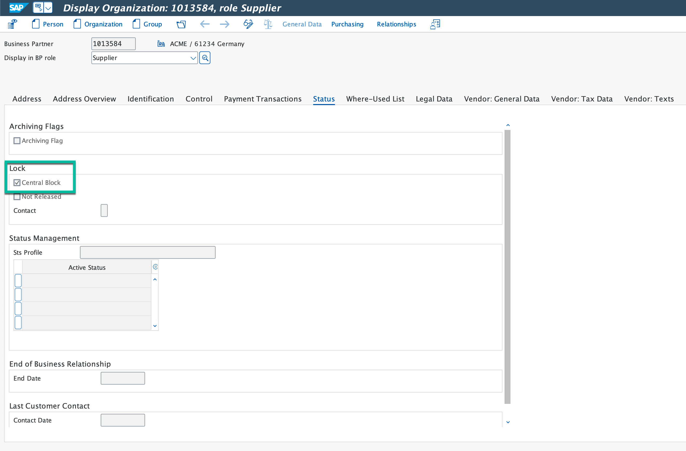

4. Choose **Vendor: General Data**. You will see that **Payment block** field is enabled.

    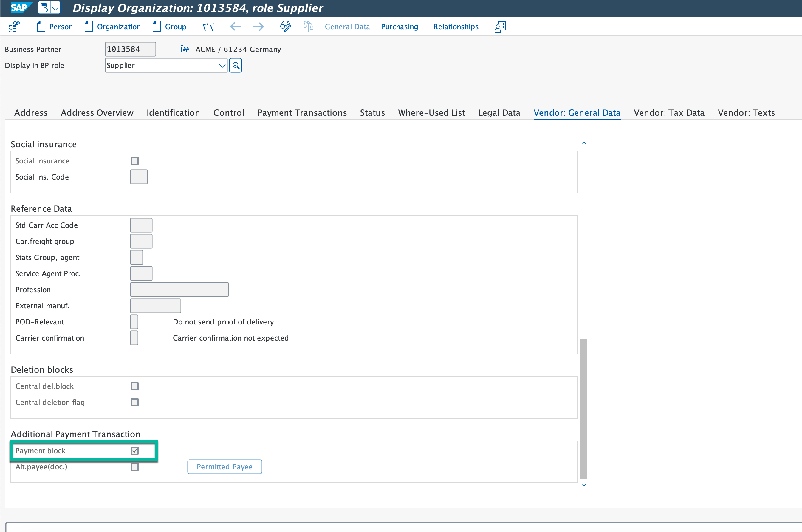

5. Choose **Purchasing** > **Purchasing Data**. You will see that **Purchasing block** field is enabled.

    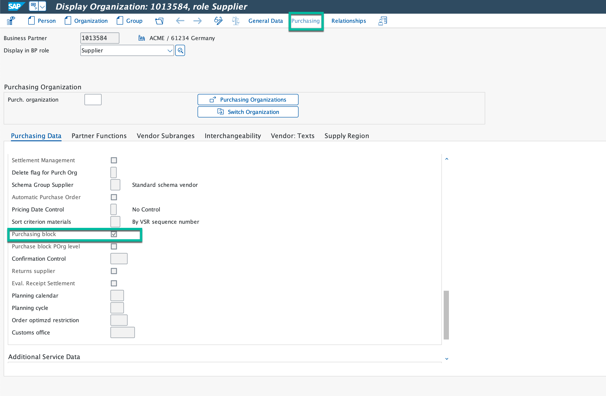

### Verify Supplier in Business Partner Validation

1. Open **Business Partner Validation** application. You will find the supplier details with status **New**.

    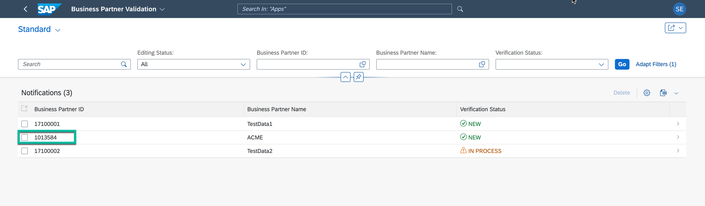

2. Change the **Status** to **Verified**.

    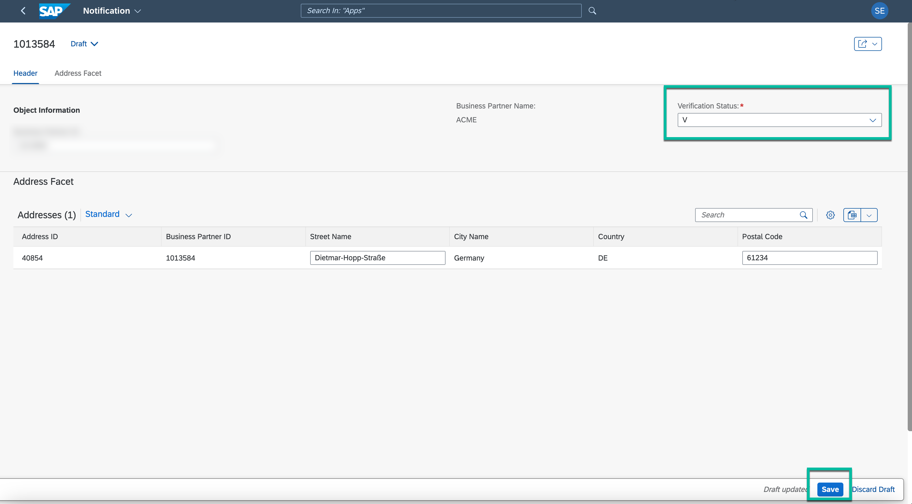

3. Refresh the application. The status has changed to **Completed**.

    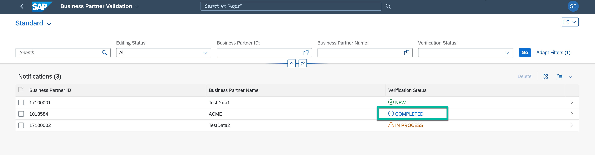

### Verify Supplier Cental Block Status in SAP S/4HANA

1. Choose **Address**. The **Search Term** field updated with **Verified**.

    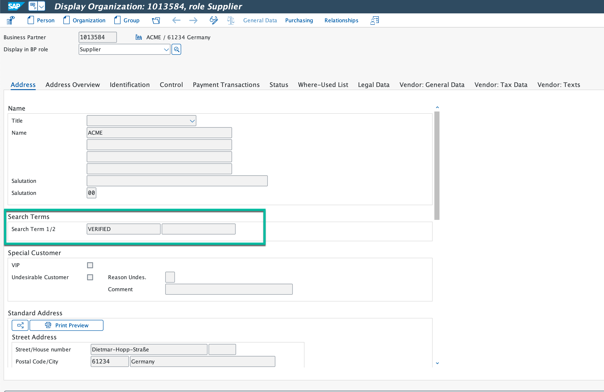

2. Choose **Status**. The **Central block** field is now disable.

### Monitoring the Process Flow

Choose your process instance **Supplier final validation**. The process is waiting for the task **Enable Payment and Purchases to Supplier** to be completed. 

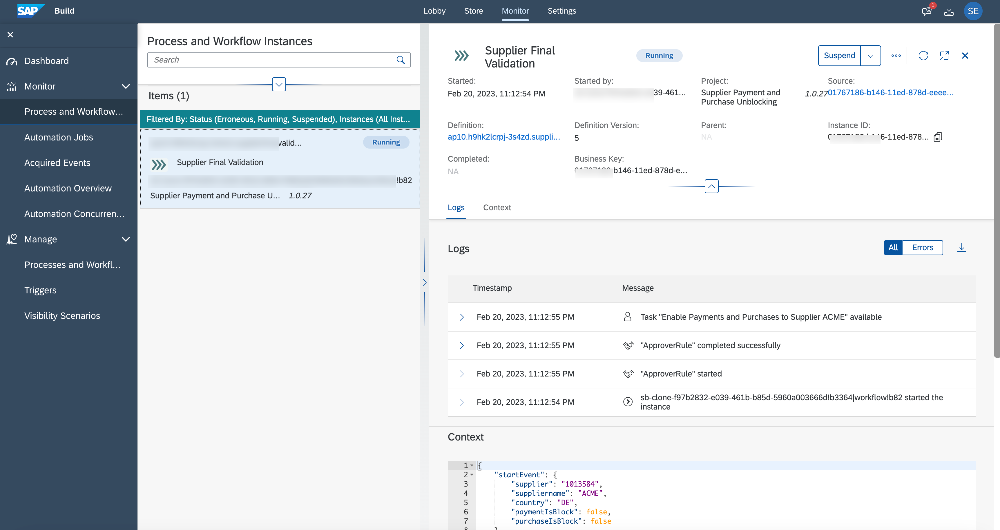

### Accessing the Payment and Purchase Enable Tasks

The process is waiting for the task to be completed. These tasks are generated from the **Business Partner Validation** application and can be accessed via the **My Inbox** application. Choose **Approve**.

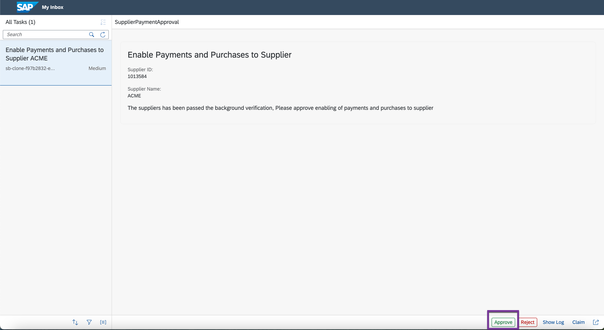

### Verify Supplier Payment and Purchase Status in SAP S/4HANA

1. Choose **Vendor: General Data**. The **Payment block** field is now disabled.

    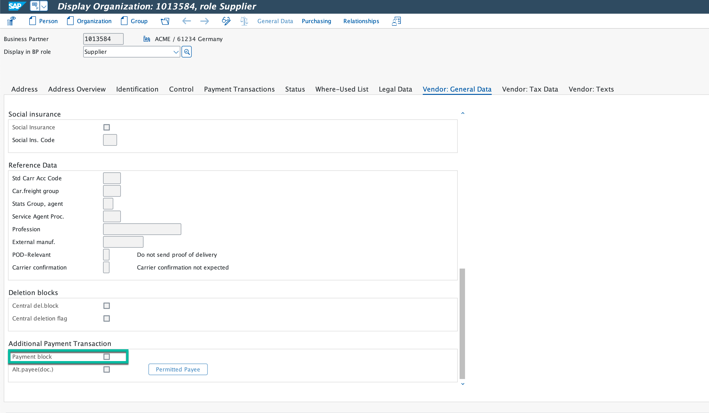

2. Choose **Purchasing** > **Purchasing Data**. The **Purchase block** field is now disable.

    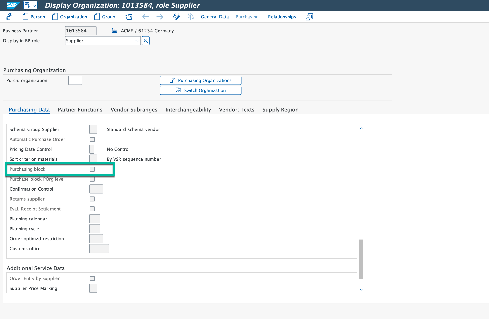

3. If you are interested to review your supplier in SAP S/4HANA Fiori launchpad, you can open it from the **/UI2/FLP** transaction.

    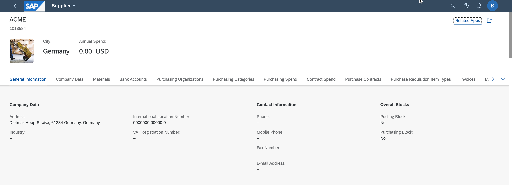

