# Configure Actions

Action is one of the feature in SAP Process Automation. Action is a mean to connect processes with external systems, be it SAP or non-SAP systems. This is an important piece of the puzzle especially if you want to automate or extend your business processes for any available line of business like SAP S/4HANA, SAP Ariba, SAP SuccessFactors and many more. These extensions can be easily build using SAP Process Automation, and using Actions you can connect to any SAP System and can do any kind of operation like GET, POST, PATCH and other calls.

## 1. Download API Specification for API_BUSINESS_PARTNER.

1. Login to [SAP API Business Hub](https://api.sap.com). Find the [Business Partner (A2X)](https://api.sap.com/api/OP_API_BUSINESS_PARTNER_SRV/overview) API for SAP S/4HANA.

2. Choose **API Specification** and download the JSON file.

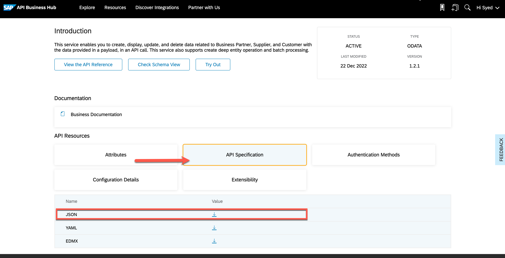.

## 2. Add BTP Destination in SAP Build

1. Navigate to **Settings** tab.

2. Choose **Destinations**.

3. Choose **New Destination**.

4. Choose **bupa**.

5. Choose **Add**.

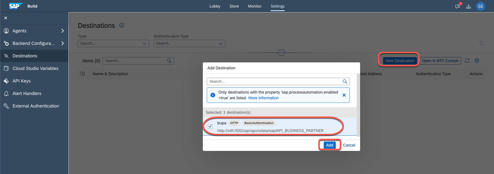

## 3. Create Action Project

1. Open SAP Build and choose **Lobby**. Then, choose **Create**.

    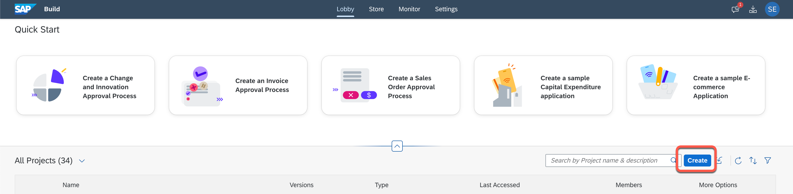

2. In the popup, choose **Build an Automated Process**.

    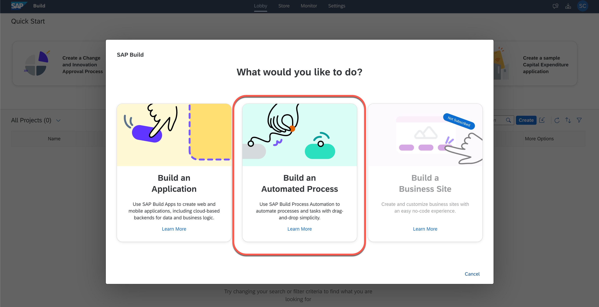

3. Choose **Actions**.

    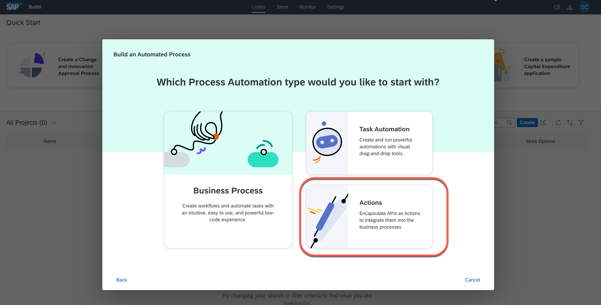

4. Choose **Upload API Specification** tile under **API Specification**.

    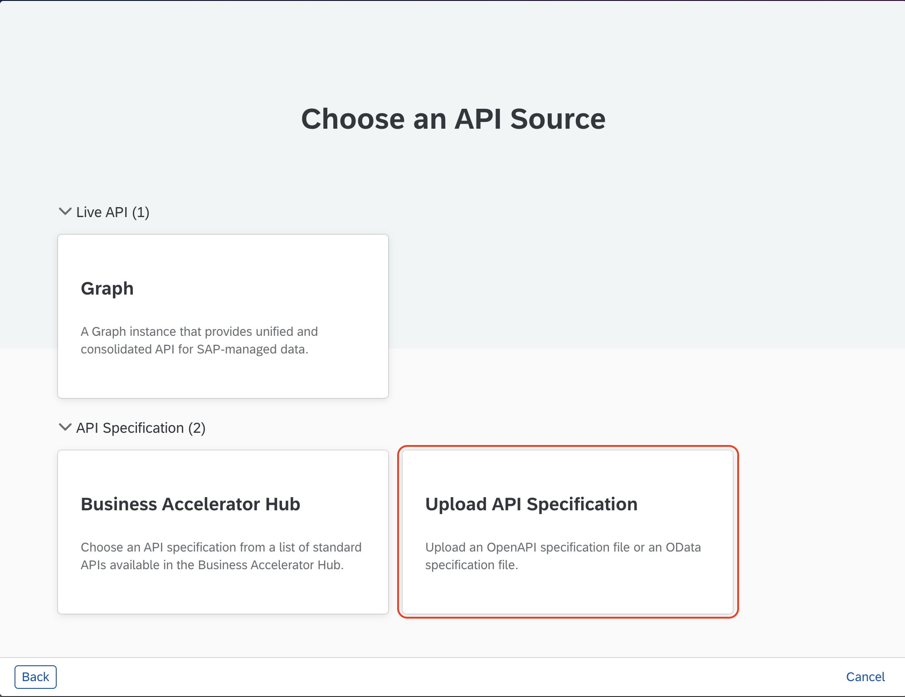

5. Choose **Browse Files** and browse for the json file you downloaded from SAP API Business Hub.

    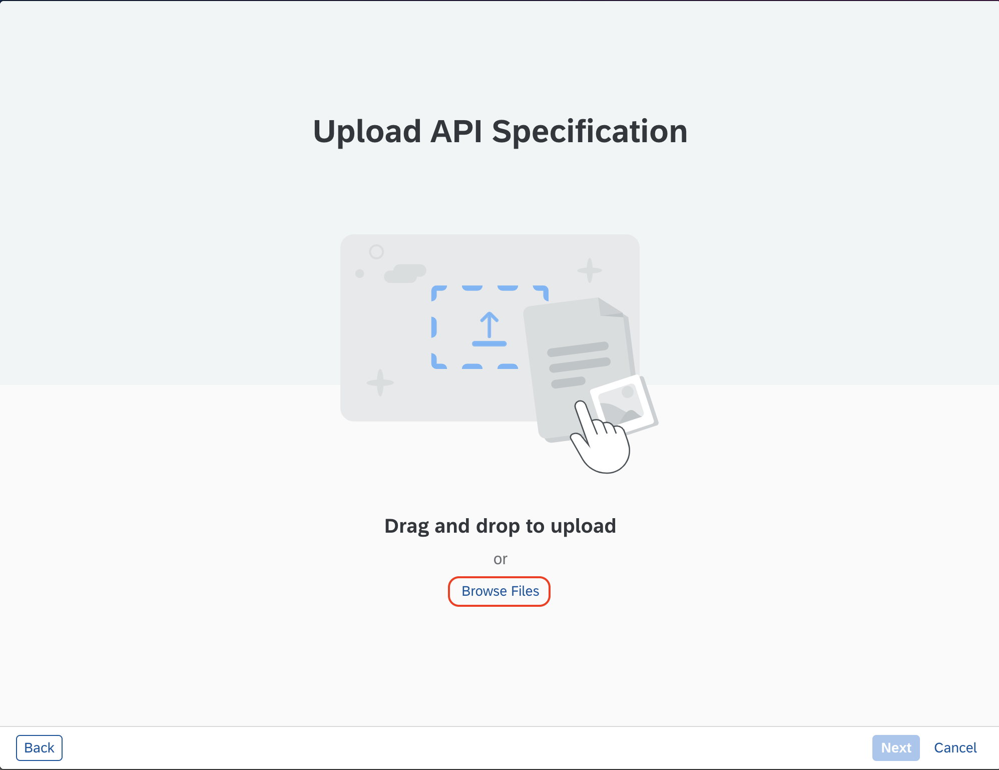

6. After uploading json file, Choose **Next**

    

7. In the Final Step, do the following:

    - In the **Project Name** field, enter **businesspartner**.
    - In the **Short Decription** field, enter **API to create supplier in S/4HANA system**.
    - Choose **Create**

    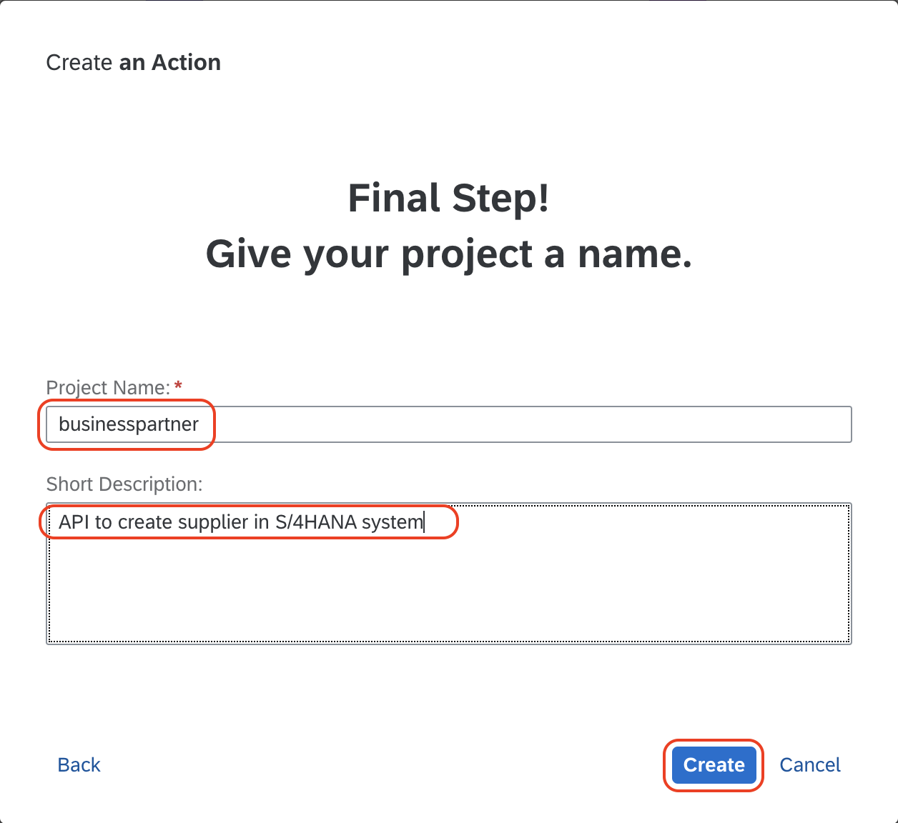

    Once the action project is created, the action editor will automatically open. 

8. In the **Actions Type** dropdown, choose **GET**, **POST** and **PATCH**.

    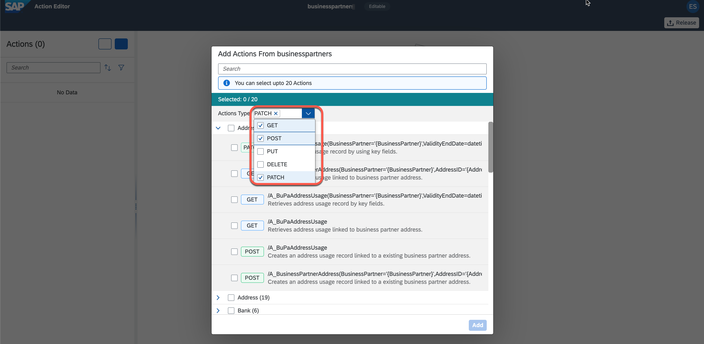

9. In the Action **Business Partner**, choose below actions.

    | **Method**    |  **Action**    | **Description** |
    | ----------- | ----------- | -----------    |
    | GET  | /A_BusinessPartner | Retrieves business partner general data |
    | POST     | /A_BusinessPartner  | Create a new business partner record |
    
    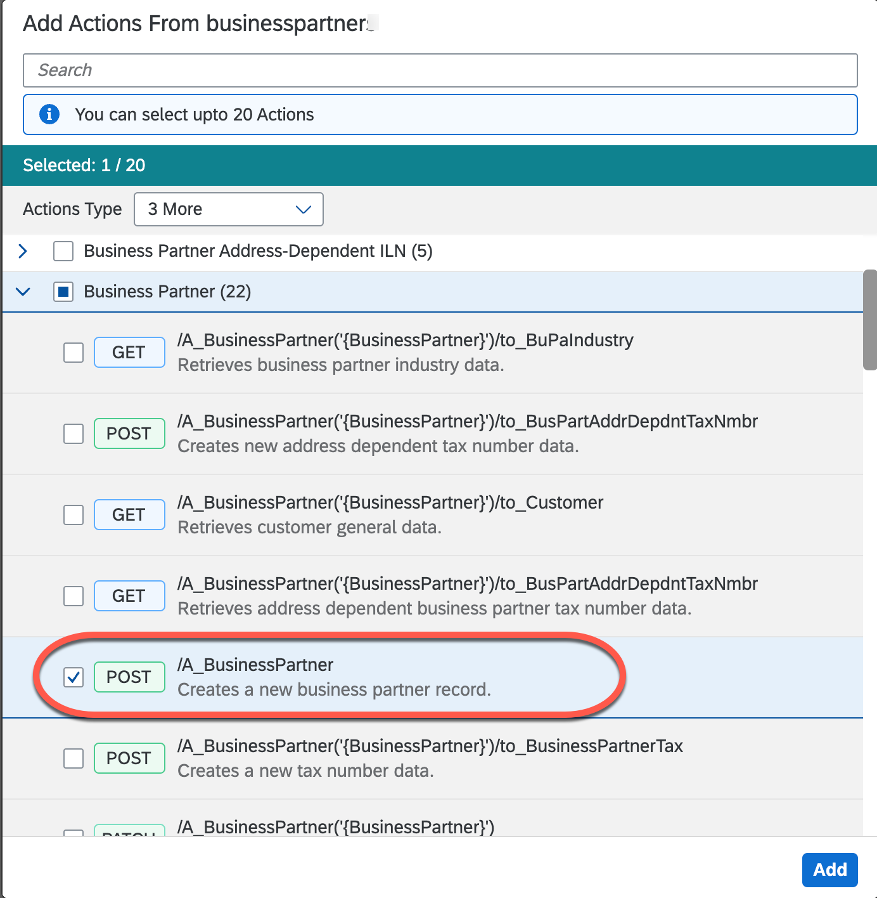

    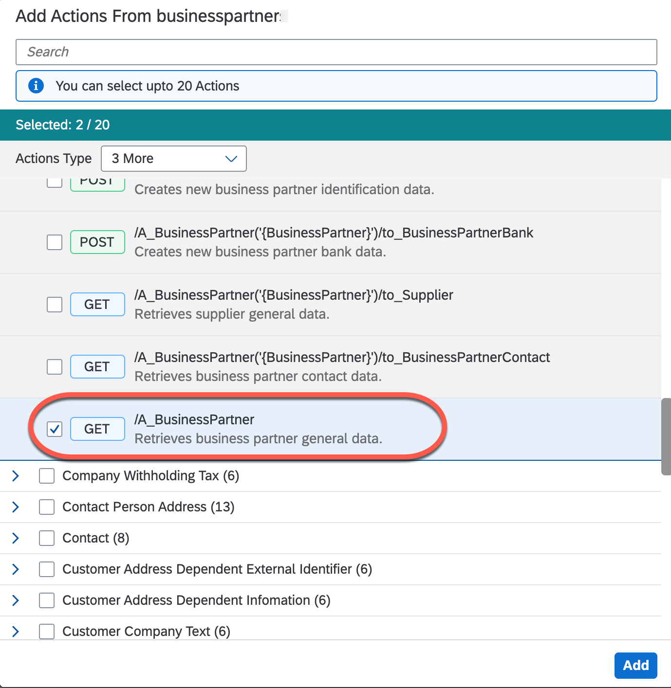

10. In the Action **Supplier**, choose below actions.

    | **Method**    |  **Action**    | **Description** |
    | ----------- | ----------- | -----------    |
    | PATCH     | /A_Supplier('{Supplier}')  | Updates supplier general data. |

    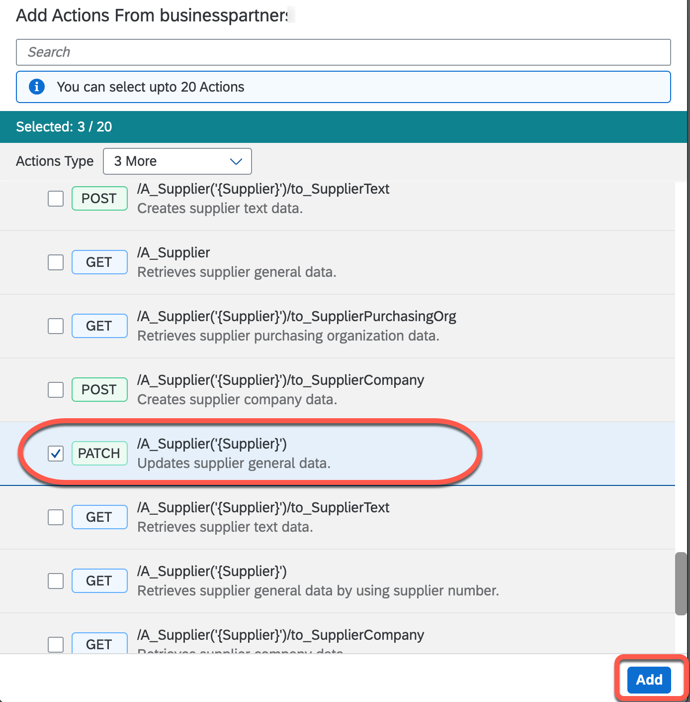

11. Choose **Add**

12. Now, you will update the input/output fields of the action project **Creates a new business partner record** to keep only the mandatory fields that are needed to **create** the supplier. To select the Input fields, do the following:

    - Sort Key in ascending order by clicking on the key column and select the Sort Ascending option.

      

    - Select All the fields by clicking on the checkbox of Key column.

    - Uncheck the following fields so that they are added as Input.

        | **Keys selected as Input** | 
        | ----------- | 
        | BusinessPartnerCategory |
        | BusinessPartnerIsBlocked |
        | OrganizationBPName1     | 
        | to_BusinessPartnerRole  | 
        | to_BusinessPartnerAddress |

    - Click cross to delete rest of the unwanted fields.

      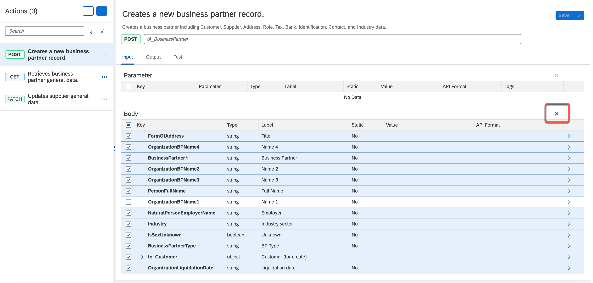

    - In the confirmation popup, click Remove.
    
      

13. Repeat the previous steps to remove the unwanted field in **to_BusinessPartnerAddress**

    - Select All the fields **to_BusinessPartnerAddress** by clicking on the checkbox of Key column.
    - Uncheck the following fields so that they are added as Input.

        | **Keys selected as Input** | 
        | ----------- | 
        | Country   | 
        | CityName  | 
        | PostalCode |
        | StreetName |
        | Language |

        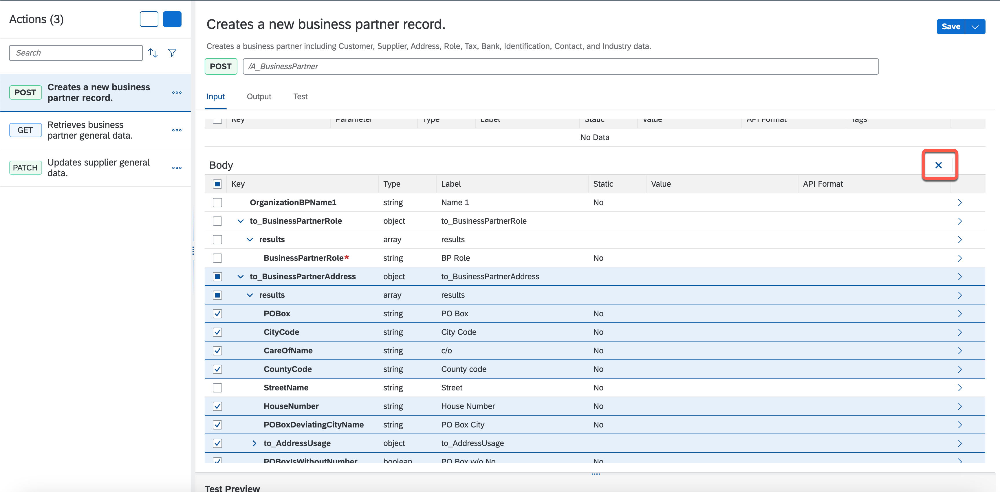
        
14. Repeat the previous steps to remove the unwanted field in **to_BusinessPartnerRole**

    - Select All the fields **to_BusinessPartnerRole** by clicking on the checkbox of Key column.
    - Uncheck the following fields so that they are added as Input.

        | **Keys selected as Input** | 
        | ----------- | 
        | BusinessPartnerRole     | 

        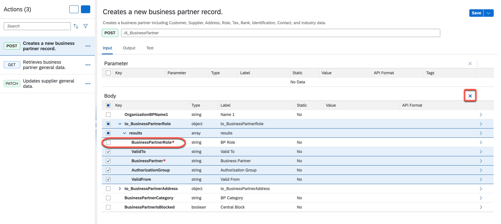        

15. Choose **BusinessPartnerCategory**.
    - In the **Static** field, choose **YES**.
    - In the **Value** field, enter **2**.

    

16. Choose **Language**.
    - In the **Static** field, choose **YES**.
    - In the **Value** field, enter **en**.

    
    
17. Choose **Save**.

18. Your final actions **Creates a new business partner record** will look like below.

    

19.  Now, you will update the input/output fields of the  to keep only the mandatory fields that are needed to **update** the supplier. To select the Input fields, do the following:

20. Select All the fields by clicking on the checkbox of Key column.

    - Uncheck the following fields so that they are added as Input.

        | **Keys selected as Input** | 
        | -------------------------- | 
        | PurchasingIsBlocked    |
        | PaymentIsBlockedForSupplier |
        

    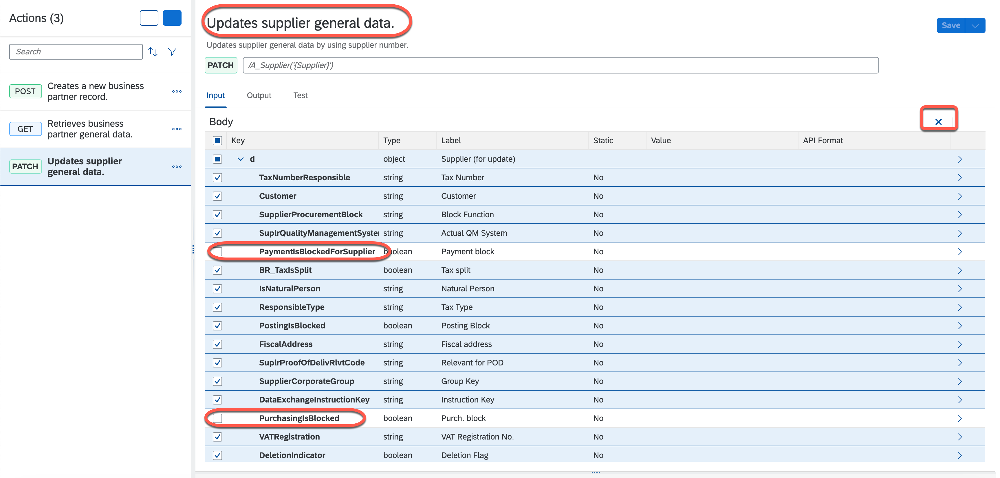

21. Your final actions **Updates supplier general data** will look like below.

    

22. Choose **Save**
        
## 4. Update X-CSRF of Post Actions

1. Choose actions **POST Creates a new business partner record.**.

    - Choose settings icon.
    - Choose **CSRF**.
    - In the **Enable CSRF**, choose **YES**.
    - In the **Token Fetch End Point** field, enter **/**
    - Choose **Save**

        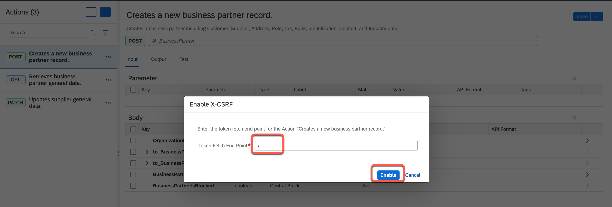

2. Repeat the same steps for actions **PATCH Updates supplier general data**.

## 5. Release the actions project

You will now release the action project to create version(s) and then publish a selected version in the action repository. It is then these published actions that can be used in different processes and applications to connect to external systems.

1. Choose **Release** to release a version of the action project.

2. In the release popup, enter the  **Release Notes** of your choice, choose **Release**.

    

## 6. Publish action project 

Once the action project is released, you can the publish any release version of the action by choosing **Publish to Library** .

1. Open SAP Build and choose **Lobby**. Then, choose your actions **businesspartner**.

2. Choose three dots.

3. Choose **Publish to Library**

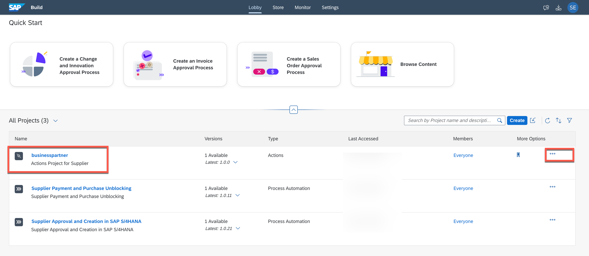

4. Choose **Publish**.

## 7. Test Actions Project with Destination in SAP BTP

1. Choose the  **Retrieves business partner general data** action.

2. Choose the **Test** tab.

3. In the **Host** field, choose **Destination**.

4. In the **Destination** dropwdown menu, choose **bupa**.

5. In **Test Input Values**, choose **$top** field and enter any values from **1** to **5**.

6. Choose **Test**.

    In the **Response Preview** section, you should see status **200 OK**.
    
    

 

