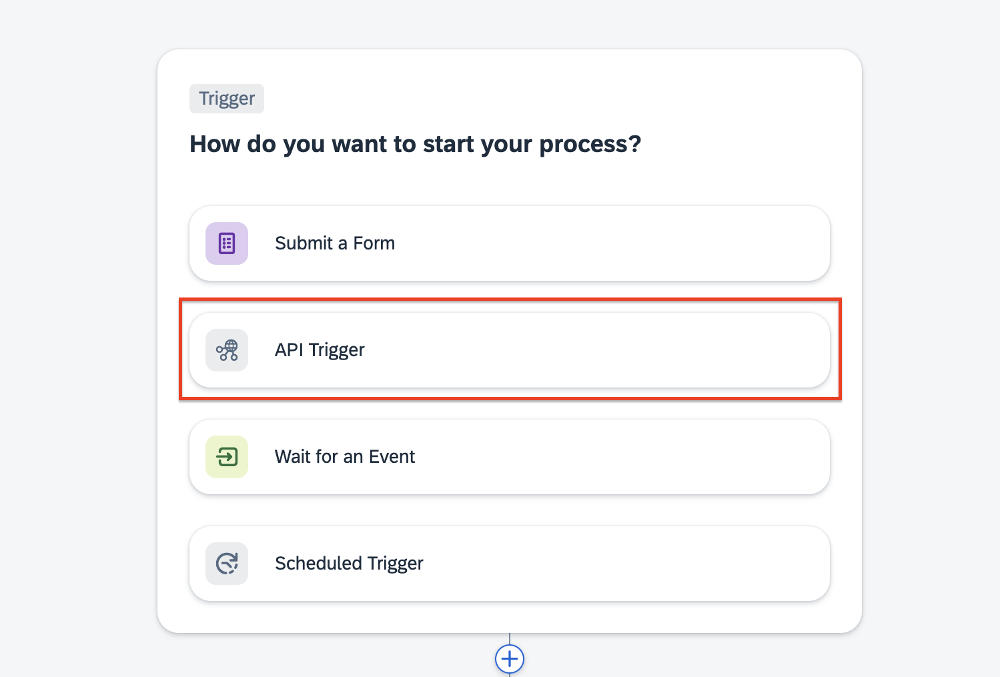
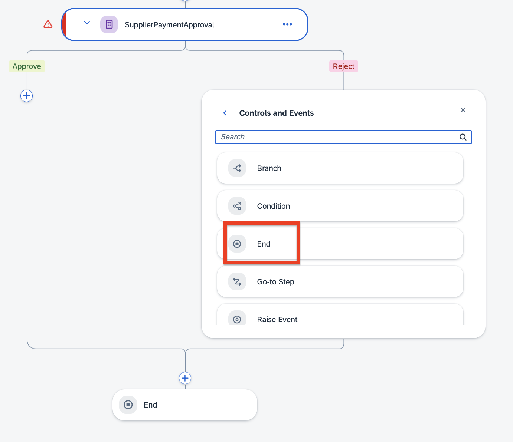
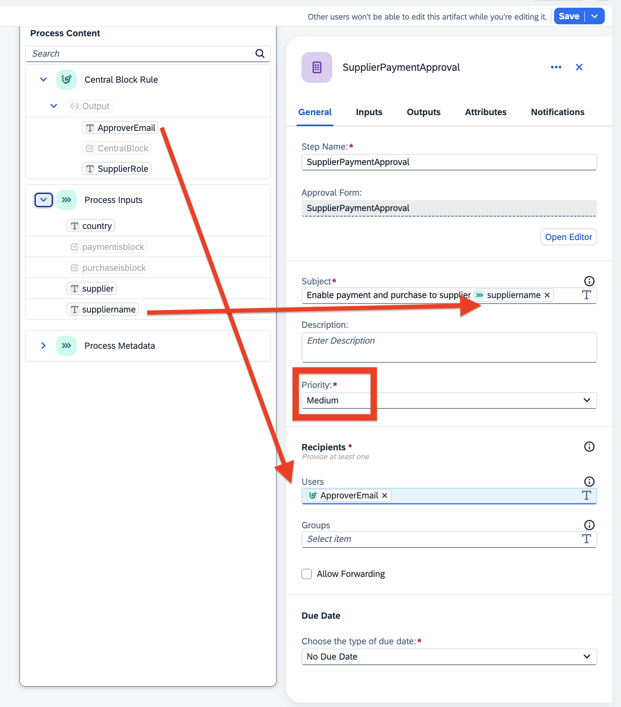
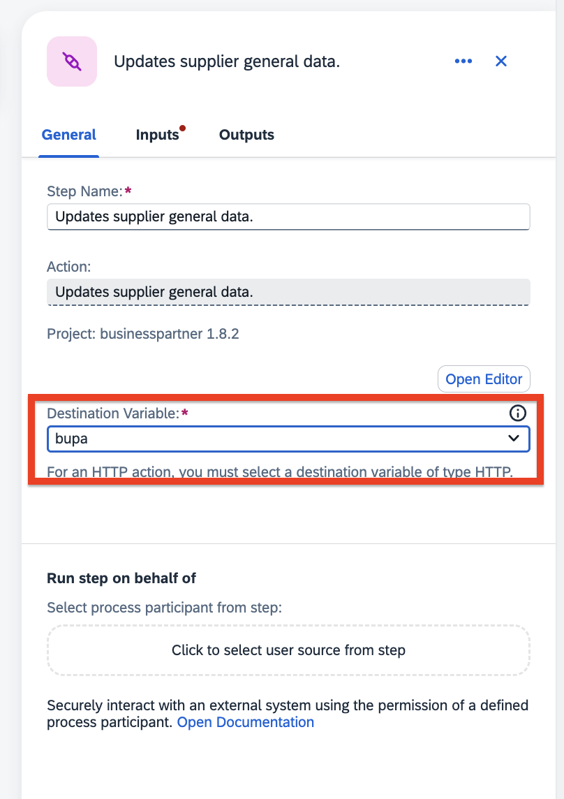

# Configure Business Process for **Supplier Payment and Purchase Unblocking in SAP S/4HANA**

This process will unblock the supplier onboarded in SAP S/4HANA to make payments and purchases.

## 1. Create a Business Process Project in SAP Build

1. Open **SAP Build Lobby**.

2. Click on **Create** from the *Create* dropdown.

    

3. In the Create Project dialog box, under **Objective**, choose an **Automated Process** and click on **Next**.

    

4. Under **Type**, select the development configuration as **Process**, and click on **Next**.

    

5. Under **Name** tab, do the following:

   - In the **Name** field, enter **Supplier Payment and Purchase Unblocking**.
   - In the **Description**, enter **Supplier Payment and Purchase Unblocking**.
   - Click on **Review**.

        

6. In the **Summary** page, review the *Objective, Type and name* given in the previous steps and click on **Create**.

    

7. The Create Process wizard appears.

## 2. Create a business process

1. A new tabs opens with the newly created project.

2. In the **Create Process** dialog box, provide the following:

   - In the **Name** field, enter **SupplierPaymentUnblock**. The value in the **Identifier** field will be automatically filled in. 
   - In the **Description** field, enter **Supplier Payment Unblock**.
   - Choose **Create**.
   
      

      You will be navigated to the main screen and you will have one default module called ***TRIGGER***.

      

3. Choose the Settings icon.

4. Choose **Environment Variables**.
    - Choose **+Create**.
    
    - In the **Identifier** field, enter **bupa**.
    - In the **Type** dropdown menu, select **Destination**.
    - Choose **Create**.

      

5. In the **Process Details** section, choose **Variables** tab.
                                                                                                  

6. Choose **Configure** for **Process Inputs**.

   
   
7. Choose **Add Input**.
    - In the **Name** field, enter **supplier**. The value in the **Identifier** field will be automatically filled in. 
    - In the **Type** dropdown menu, select **String**. 
    - Select the **Required** checkbox.
    
   -  Repeat the previous step to add the following properties:
      | **Name**    |  **Type**    | **Required** |
      | ----------- | ----------- | -----------    |
      | suppliername     | String  | Yes |
      | purchaseisblock  | Boolean | Yes |
      | paymentisblock   | Boolean | Yes |
      |  country         | String  | Yes |

   - Choose **Apply**.
      

## 3. Create Decisions

To configure the approver, you have to create a decision called **Central Block Rule** in SAP Build. To do that, follow the steps at
[Step-By-Step Guidance to Create Decisions](../create-decisions/README.md).

## 4. Create Approval

Once the supplier has been verified by the BusinessParnerValidation application, the approver gets notified about the supplier's change in the status and approves the supplier request to make payments and purchases in SAP S/4HANA.

1. In the **Overview** of **Supplier Payment and Purchase Unblocking** project, choose **Create**.

2. Choose **Approval**.

   

3. In the pop-up window for **Create Approval**:

   - In the **Name** field, enter **SupplierPaymentApproval**.
   - In the **Description** field, enter **Approval for Supplier Payment Unblock**.
   - Choose **Create**.

      

4. You will now design the **SupplierPaymentApproval** with available layout and input fields options. First, drag-and-drop the form layout fields and enter the given names and field settings as below:

    | **Form Fields** |  **Field Settings with Label**    | 
    | ----------- | ----------- | 
    | Headline 1(H1)     | Enable Payment and Purchases to Supplier  | 

5. Now, add **Inputs** Fields, enter the labels and select the **Read Only** checkbox.

     **Form Fields** |  **Field Settings with Label**    | 
    | ----------- | ----------- | 
    | Text     | Supplier ID  | 
    | Text     | Supplier Name  | 
    | Paragraph     | The Supplier has passed the Background Verification. Please approve that the supplier is now able to do payment and purchases  | 

6. Choose **Save**.

   

## 5. Create Process

1. From the Overview, go to process **SupplierPaymentUnblock** created earlier. In the **Trigger** module, choose **Add a Trigger**.
   
   
3. Choose **API Trigger**.
   
   
4. In the **Create API Trigger** wizard, configure the following properties:
    - In the **Name** field, enter **supplierAPI**.
    - In the **Description** field, enter **Supplier Trigger API**.
    - Choose **Create**
      

5. In branch of the **Trigger** module, 
   - Choose **+**
   - Choose **Decision**
      
   - Choose **Central Block Rule**
      

6. In the **Central Block Rule** decision, Choose **Inputs** tab and bind the below items.
   - Select **Single Properties**.
   - In the country field, choose **country** from **Process Inputs**.
   
   
7. Choose **+** sign in decision branch after **Central Block Rule**.

8. Choose **Approval**, and under Available Approvals, select **SupplierPaymentApproval**.

   
   
   
9. In the Supplier Approval approval form, Under Reject side choose **+** icon. And choose **Controls and Events**.
   

10. Under **Flow logic** choose End.

   

11. In the **SupplierPaymentApproval** approval, choose **General** tab and Bind the below items.

      - In the **Subject** field, enter **Enable Payment and Purchase to Supplier** and click **suppliername** from **Process Inputs**
      - In the **Priority** field, choose **Medium**.
      - In the **Users** field, choose **ApproverEmail** from **Central Block Rule**.

         
   
12. In the **SupplierPaymentApproval** approval, choose **Input** tab and Bind the below items.

      - In the **Supplier ID** field, choose **supplier** from **Process Inputs**.
      - In the **Supplier Name** field, choose **suppliername** from **Process Inputs**.

         
   
13. In the **SupplierPaymentApproval** approval, choose **+** from **Approve** branch side.

14. Choose **Action** > Choose **Browse All Actions**.

      
      
   
15. In the **Projects** field, enter **businesspartner**. > Choose **Show Filters** to see the **Projects field**
      
      

16. choose Actions **Updates supplier general data** and choose **Add**.

      
   
17. In the actions **Updates supplier general data**, choose **General** tab. 

18. In the **Destination Variable** field, choose **bupa** .

      

19. Choose **Inputs** tab, select **Single Properties**.

      - In the **PaymentBlockedForSupplier** field, choose **paymentIsBlock** from **Process Inputs**.
      - In the **PurchasingIsBlocked** field, choose **purchaseIsBlock** from **Process Inputs**.
      > In updated api spec, updated name of PaymentBlockedForSupplier is Payment block, PurchasingIsBlocked is Purch. Block

20. In the **Supplier** field, choose **supplier** from **Process Inputs**.

21. Choose **Save**.

      

22. Your final Process look like below.

      

## 6. Release the Process
   
1. Choose **Release**

   - For new release, choose **Release** leaving the **Version Number** unchanged.

      

   - For releasing it from second time and so on.., do the following:

     1. In the **Version**, choose **Contains only Patches**.

     2. Choose **Release**.
   
      

## 7. Deploy the Process   

1. Select the **Released version** > Choose **Deploy**.

   

3. Choose **Public** and click on **Deploy**.

    

4. In **Effect on Triggers** pop-up, click on **Deploy**.

5. In the **Define Variables** dialog box, do the following:

    - Choose **Set new value**
    - In the **Destination** dropdown, choose **bupa**.
    - Choose **Deploy**.

        

`

