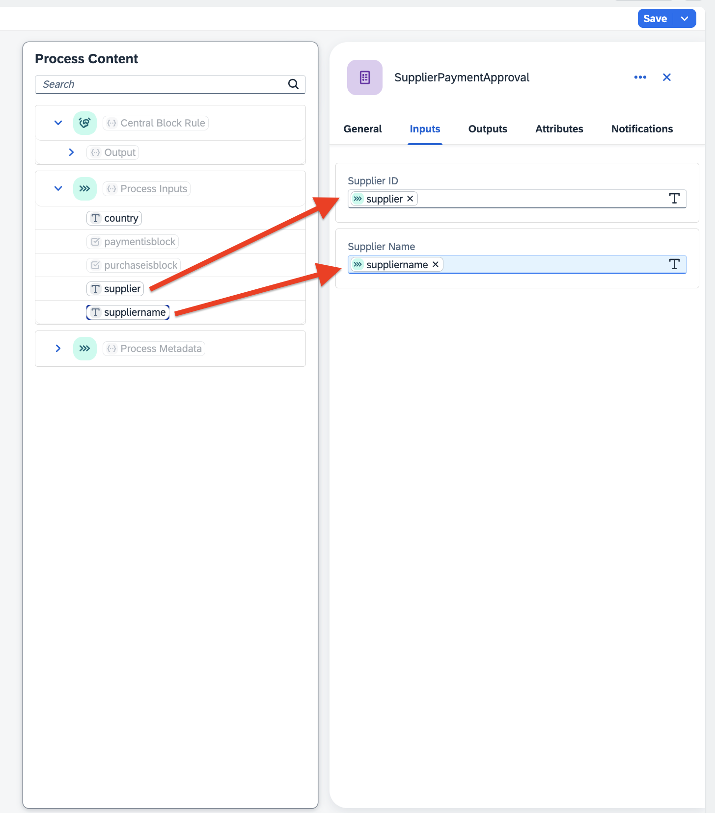

# Configure Business Process for **Supplier Payment and Purchase Unblocking in SAP S/4HANA**

This process will unblock the supplier onboarded in SAP S/4HANA to make payments and purchases.

## 1. Create a Business Process Project in SAP Build

1. Log in to SAP Build. Choose **Create**.

   

2. Choose **Build an Automated Process**.

   

3. Choose **Business Process**

   

4. In the **Create a Business Process** dialog box, do the following:

   - In the **Project Name** field, enter **Supplier Payment and Purchase Unblocking**.
   - In the **Short Description**, enter **Supplier Payment and Purchase Unblocking**.
   - Choose **Create**. The **Create Process** wizard appears.

   

## 2. Create a business process

1. A new tabs opens with the newly created project.

2. In the **Create Process** dialog box, provide the following:

   - In the **Name** field, enter **SupplierPaymentUnblock**. The value in the **Identifier** field will be automatically filled in. 
   - In the **Description** field, enter **Supplier Payment Unblock**.
   - Choose **Create**.
   
   

   You will be navigated to the main screen and you will have one default module called ***TRIGGER***.

   

3. Choose the Settings icon.

4. Choose **Environment Variables**.
    - In the **Identifier** field, enter **bupa**.
    - In the **Type** dropdown menu, select **Destination**.
    - Choose **Create**.

      

5. In the **Process Details** section, choose **Inputs**.

6. Choose **Configure**.

   
   
7. Choose **Add Input**.
    - In the **Name** field, enter **supplier**. The value in the **Identifier** field will be automatically filled in. 
    - In the **Type** dropdown menu, select **String**. 
    - Select the **Required** checkbox.
    
   -  Repeat the previous step to add the following properties:
      | **Name**    |  **Type**    | **Required** |
      | ----------- | ----------- | -----------    |
      | **suppliername**     | **String**  | **Yes** |
      | **purchaseisblock**  | **Boolean** | **Yes** |
      | **paymentisblock**   | **Boolean** | **Yes** |
      |  **country**         | **String**  | **Yes** |

8. Choose **Apply**.

   

## 3. Create Decisions

To configure the approver, you have to create a decision called **Central Block Rule** in SAP Build. To do that, follow the steps at
[Step-By-Step Guidance to Create Decisions](../create-decisions/README.md).

## 4. Create Approval

Once the supplier has been verified by the BusinessParnerValidation application, the approver gets notified about the supplier's change in the status and approves the supplier request to make payments and purchases in SAP S/4HANA.

1. In the **Overview** of **Supplier Payment and Purchase Unblocking** project, choose **Create**.

2. Choose **Approval**.

   

3. In the pop-up window for **Create Approval**:

   - In the **Name** field, enter **SupplierPaymentApproval**.
   - In the **Description** field, enter **Approval for Supplier Payment Unblock**.
   - Choose **Create**.

   

4. You will now design the **SupplierPaymentApproval** with available layout and input fields options. First, drag-and-drop the form layout fields and enter the given names and field settings as below:

    | **Form Fields** |  **Field Settings with Label**    | 
    | ----------- | ----------- | 
    | **Headline 1(H1)**     | ***Enable Payment and Purchases to Supplier**  | 

5. Now, add **Inputs** Fields, enter the labels and select the **Read Only** checkbox.

     **Form Fields** |  **Field Settings with Label**    | 
    | ----------- | ----------- | 
    | **Text**     | **Supplier ID**  | 
    | **Text**     | **Supplier Name**  | 
    | **Paragraph**     | **The Supplier has passed the Background Verification. Please approve that the supplier is now able to do payment and purchases**  | 

6. Choose **Save**.

   

## 5. Create Process

1. In the **Trigger** module, choose **+**. Then, choose **API** > **New API Trigger**.

   
   
2. In the **Create API Trigger** wizard, configure the following properties:
    - In the **Name** field, enter **supplierAPI**.
    - In the **Description** field, enter **Supplier Trigger API**.

3. Choose **Create**.

   

4. In branch of the **Trigger** module, choose **+**. Then, choose **Decision** > **Central Block Rule**.

   

5. In the **Central Block Rule** decision, choose **Inputs**. Put the cursor in the **country** field. The **Process Content** section appears. Choose **country** from **Process Inputs**. The **country** field is bound in the **country** field of **Input** section.

   
   
6. Choose **+** sign in decision branch.

7. Choose **Approval** > **SupplierPaymentApproval**.

   
   
8. From Reject branch Choose **+**

9. Choose **Controls** > **End**.

   

10. In the **SupplierPaymentApproval** approval, choose **General** tab and Bind the below items.

   - In the **Subject** field, enter **Enable Payment and Purchases to Supplier** and  Drag **suppliername** from **Process Inputs**
   - In the **Priority** field, choose **Medium**.
   - In the **Users** field, choose **ApproverEmail** from **ApproverRule**.

   
   
11. In the **SupplierPaymentApproval** approval, choose **Input** tab and Bind the below items.

   - In the **Supplier ID** field, choose **supplier** from **Process Inputs**.
   - In the **Supplier Name** field, choose **suppliername** from **Process Inputs**.

   
   
12. In the **SupplierPaymentApproval** approval **Approve** branch choose **+**.

13. Choose **Actions** > **Browse Library**.

   
   
14. In the **Projects** , enter **businesspartner**. 

15. choose Actions **Updates Supplier General Data** and choose **Add**.

   
   
16. In the actions **Updates Supplier General Data**, choose **General**. 

17. In the **Destination Variable** field, choose **bupa** .

   

18. Choose **Input**.

19. In the **PaymentBlockedForSupplier** field, choose **paymentIsBlock** from **Process Inputs**.

20. In the **PurchasingIsBlocked** field, choose **purchaseIsBlock** from **Process Inputs**.

21. In the **Supplier** field, choose **supplier** from **Process Inputs**.

22. Choose **Save**.

   

23. Your final Process look like below.

   

## 6. Release the Process
   
1. Choose **Release**

2. In the **Version**, choose **Contains only Patches**.

3. Choose **Release**.
   > Note here that it will only come if the release is already created. For new release, just choose **Release**.

   

## 7. Deploy the Process   

1. Choose **Deploy**.

   

2. In the **bupa** data type,choose **Set new value**.

3. In the **Destination** field, choose **bupa**.

4. Choose **Next**.

   

5. Choose **Deploy**

   
   

`

