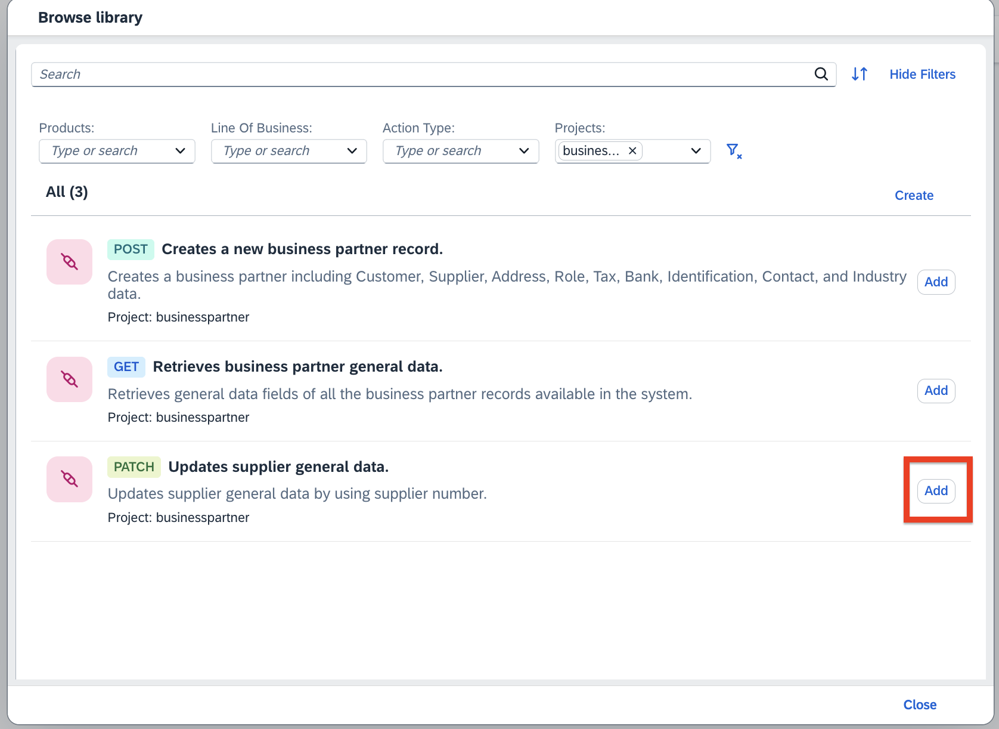

# Configure Business Process for Supplier Approval in SAP S/4HANA

This Processes will automate the onboarding of supplier created from supplier request form in SAP S/4HANA.

1. Open SAP Build and choose **Lobby**. Then, choose **Create**.

    

2. Choose **Build an Automated Process**.

   

3. Choose **Business Process**

   

4. In the **Create a Business Process** dialog box, do the following:

   - In the **Project Name** field, enter **Supplier Approval and Creation in SAP S/4HANA**.
   - In the **Short Description**, enter **Supplier Approval in SAP S/4HANA**.
   - Choose **Create**. The **Create Process** wizard appears.

   

## 2. Create a business process

1. A new tabs opens with the newly created project.

2. In the **Create Process** dialog box, provide the following:

   - In the **Name** field, enter **Supplier Approval**. The value in the **Identifier** field will be automatically filled in. 
   - In the **Description** field, enter **Supplier Approval Process**.
   - Choose **Create**.
   
   

   You will be navigated to the main screen and you will have one default module called ***TRIGGER***.

   
   
3. Choose the Settings icon.

4. Choose **Environment Variables**.

    - In the **Identifier** field, enter **bupa**.
    - In the **Type** dropdown menu, choose **Destination**.
    - Choose **Create**.

        

## 3. Create Decisions

To configure the approver, you have to create a decision called **ApproverRule** in SAP Build. To do that, follow the steps at
[Step-By-Step Guidance to Create Decisions](../create-decisions/README.md).

## 4. Create Supplier Request Form

This request form will serve as a trigger form to enter all relevant details of supplier to starts it's onboarding process.

1. In the **Overview** of Supplier Approval and Creation in SAP S/4HANA, choose **Create**.

2. Choose **Form**.

    

3. In the **Create Form** wizard fields, enter the following parameter. 

    - In the **Name** field, enter **Supplier Request Form**.
    - In the **Description** field, enter **Supplier Request Form**.

4. Choose **Create**.

   

5. You will now design the **Supplier Request Form** with available layout and input fields options. First, drag-and-drop the form layout fields and enter the given names and field settings as below:

    | **Form Fields** |  **Field Settings with Label**    | 
    | ----------- | ----------- | 
    | **Headline 1(H1)**     | **/Request Form for Supplier Validation**  | 

6. Now, add **Inputs** Fields, enter the labels and select the **Required** checkbox.

     **Form Fields** |  **Field Settings with Label**    | 
    | ----------- | ----------- | 
    | **Text**     | **Supplier Name**  | 
    | **Text**     | **Street**  | 
    | **Text**     | **City**  | 
    | **Text**     | **Postal Code**  | 
    | **Dropdown**     | **Country**  | 

    

7. In the **Country** fields, enter the below value in dropdown.
    - **IN** 
    - **DE** 
    - **US**    

    

8. Choose **Save**.

## 5. Create Supplier Approval

The supplier approval form will be used to get faster and easier approvals from the business users, to take informed decisions, and get rid of sending emails. These approval forms could be about approving or rejecting newly reqeuested supplier. The forms are then converted into tasks in an automated workflow which will appear in the **My Inbox** of the user.

1. In the **Overview** of Supplier Approval and Creation in SAP S/4HANA, choose **Create**.

2. Choose **Approval**.

    

3. In the **Create Approval** wizard fields, enter the following parameter. 

    - In the **Name** field, enter **Supplier Approval Form**.
    - In the **Description** field, enter **Supplier Approval**.
    - Choose **Based on a Form** checkbox.
    - In the dropdpwn, choose **Supplier Request Form**.

4. Choose **Create**. You will be navigated to approval where you can see all the inputs which is picked up from request form.

    

5. You will now design the **Supplier Approval Form** with available layout and input fields options. First, drag-and-drop the form layout fields and enter the given names and field settings as below:

    | **Form Fields** |  **Field Settings with Label**    | 
    | ----------- | ----------- | 
    | **Paragraph**  | **Post acceptance, new supplier will be created in SAP S/4HANA System and Verification process will be triggered**  | 

    

6. Choose **Save**.

## 6. Create Supplier Confirmation Form

After the user approves or rejects the request, the next step is to create notifications. These notifications will inform the requester whether their supplier is added in SAP S/4HANA, and will be sent either via an email or through the form. They will appear in the **My inbox** of the requester as a task.

1. Choose **Create**.

2. Choose **Form**

    

3. In the **Create Form** wizard fields, enter the following parameter. 

    - In the **Name** field, enter **Supplier Confirmation**.
    - In the **Description** field, enter **Supplier Notification**.

4. Choose **Create**.

    

5. You will now design the **Supplier Confirmation Form** with available layout and input fields options. First, drag-and-drop the form layout fields and enter the given names and field settings as below:

    | **Form Fields** |  **Field Settings with Label**    | 
    | ----------- | ----------- | 
    | **Headline 1(H1)**  | **Your SAP S/4HANA has recorded new supplier with below details**  | 

6. Now, add **Inputs** Fields, enter the labels and select the **Read Only** checkbox.

     **Form Fields** |  **Field Settings with Label**    | 
    | ----------- | ----------- | 
    | **Text**     | **Supplier**  | 
    | **Text**     | **Supplier Name**  | 
    | **Text**     | **Street**  | 
    | **Text**     | **City**  | 
    | **Text**     | **Postal Code**  |
    | **Text**     | **Country**  | 
    | **Checkbox**     | **Central Block**  | 
    | **Checkbox**     | **Payment Block**  | 
    | **Checkbox**     | **Purchase Block**  | 
    | **Paragraph**     | **Please Click "SUBMIT" for Acknowledgement**  | 

    

    

7. Choose **Save**.

## 7. Create Process

A process condition routes the business process based on certain criteria. These conditions apply an If or Else rule to the process content and respond according to the rules defined as settings in the process builder.

1. In the **Artifacts** of Supplier Approval for SAP S/4HANA, choose **Supplier Approval** process.

    

2. In the **Trigger** module, choose **+**. Then, choose **Forms** > **Supplier Request Form**.

    

3. In branch of the **Trigger** module, choose **+**. Then, choose **Decision** > **Central Block Rule**.

    

4. In the **Central Block Rule** decison form, Choose **Inputs** tab and bind the below items.

    - In the **Country** field, choose **Country** from **Supplier Request Form (Trigger)**.

    

5. In branch of the **Decision** module, choose **+**. Then, choose **Approvals** > **Supplier Approval**.

    

6. In the **Supplier Approval** approval form, Select Reject and choose **+** icon > **Controls** > **End**.

    

7. In the **Supplier Approval** approval form, Choose **General** tab tab and bind the below items.

    - In the **Subject** field, enter **Review for Supplier** and choose **Supplier Name** from **Supplier Request Form(Trigger)**.
    - In the **Priority** field, choose **Medium**.
    - In the **Users** field, choose **ApproverEmail** from **Central Block Rule** of **Process Content**.

    

8. In the **Supplier Approval** approval form, Choose **Inputs** tab and bind the below items.

    - In the **Supplier Name** field, choose **Supplier name** from **Supplier Request Form (Trigger)**.
    - In the **City** field, choose **City** from **Supplier Request Form (Trigger)**.
    - In the **Country** field, choose **Country** from **Supplier Request Form (Trigger)**.
    - In the **Postal Code** field, choose **Postal Code** from **Supplier Request Form (Trigger)**.
    - In the **Street** field, choose **Street** from **Supplier Request Form (Trigger)**.

    

9. In branch of the **Approve** of **Supplier Approval** module, choose **+**. Then, choose **Actions** > **Browse library**.

    

10. In the **Projects** field, enter **businesspartner**.

11. Choose actions **Create a new business partner record** and choose **Add**.

    

12. In the action **Create a new business partner record** ,choose **General**.

    - In the **Destination Variable** field, choose **bupa**.

    

13. In the action **Create a new business partner record** ,choose **Inputs** and bind the below items.

    - In the **BusinessPartnerIsBlocked** field, choose **Central Block** from **Central Block Rule** of **Process Content**.
    - In the **OrganizationBPName1** field, choose **Supplier Name** from **Supplier Request Form (Trigger)** of **Process Content**.
    - choose **to_BusinessPartnerAddress** and select Single item.
    - In the **CityName** field, choose **City** from **Supplier Request Form (Trigger)** of **Process Content**.
    - In the **Country** field, choose **Country** from **Supplier Request Form (Trigger)** of **Process Content**.
    - In the **PostalCode** field, choose **Postal Code** from **Supplier Request Form (Trigger)** of **Process Content**.
    - In the **streetname** field, choose **Street** from **Supplier Request Form (Trigger)** of **Process Content**.

    

    - choose **to_BusinessPartnerRole** and select Single item.
    - In the **BusinessPartnerRole** field, choose **SupplierRole** from **Central Block Rule** of **Process Content**.

    

14. In branch of the action **Create a new business partner record** module, choose **+**. Then, choose **Actions** > **Browse library** > **Update Suplier General Data**.

    
 
15. In the action **Update Supplier General Data**, choose **General**.
    - In the **Destination Variable** field, choose **bupa**.

    

16. In the action **Update Suplier General Data**, choose **Input**.
    - In the **Supplier** field, choose **BusinessPartner** of actions **create a new business partner record**.
    - In the **PaymentBlockedForSupplier**, choose **BusinessPartnerIsBlocked** of actions **create a new business partner record**.
    - In the **PurchasingIsBlocked**, choose **BusinessPartnerIsBlocked** of actions **create a new business partner record**.

    > In updated api spec, updated name of PaymentBlockedForSupplier is **Payment block**, PurchasingIsBlocked is **Purch. Block** and BusinessPartnerIsBlocked is **Central Block**

    

17. In the action **Update Suplier General Data** module, choose **+** sign > **Forms** > **Supplier Cofirmation**.

    

18. In the form **Supplier Cofirmation** module ,choose **General** and bind the below items.

    - In the **Subject** box:
        - enter **New Supplier**
        - Choose **BusinessPartner** from actions **create a new business partner record**
        - **added in S/4HANA**
    - In the **Priority** field, choose **Medium**.
    - In the **Users** field, choose **ApproverEmail** from **Central Block Rule**.

    

19. In the form **Supplier Cofirmation** module ,choose **Inputs** and bind the below items.

    - In the **Central Block** field, choose **BusinessPartnerIsBlocked** of actions **create a new business partner record**.
    - In the **City** field, choose **City** from **Supplier Request Form (Trigger)**.
    - In the **Country**, choose **Country** from **Supplier Request Form (Trigger)**.
    - In the **Payment Block**, choose **BusinessPartnerIsBlocked** of actions **create a new business partner record**.
    - In the **Postal Code** field, choose **Postal Code** from **Supplier Request Form (Trigger)**.
    - In the **Purchase Block** fiels, choose **BusinessPartnerIsBlocked** of actions **create a new business partner record**.

    

    - In the **Street** field, choose **Street** from **Supplier Request Form (Trigger)**.
    - In the **Supplier** field, choose **BusinessPartner** from Actions **create a new business partner record**.
    - In the **Supplier Name** field, choose **Supplier Name** from **Supplier Request Form (Trigger)**.

    

20.  Below is the final layout of editor.

    
21. Choose **Save**.

## 8.Release Business Process

To run the process you have to first release and then deploy the business process project. Releasing a project creates a version or snapshot of the changes and deploying the project makes it available in runtime to be consumed. You can only deploy a released version of the project, and at a given time there can be multiple deployed versions of the same project.

1. Choose **Release**.

2.  In the **Release Project** dialog box, do the following:
    - In the **Version**, choose **Contains only patches**.
    - Choose **Release**.

        

## 9. Deploy Business Process

1. Choose **Deploy**.

2. In the **Deploy Supplier Approval for SAP S/4HANA** dialog box, do the following:

    - Choose **Next**

        

    - In the **bupa** data type,choose **Set new value**.
    - In the **Destination** field, choose **bupa**.
    - Choose **Next**.

        

    - Choose Deploy

        

