# Configure Decision for Approver, Supplier Role and Central Block

A decision diagram is a visual representation of a decision and consisting of the inputs, the output along with the relevant policies and rules. Input to a decision is the data that would be provided during execution and the rule constraints are evaluated against the input data. Output is the placeholder to store the result of this execution. Using a decision diagram, you can navigate to the input, output (result), policies of a decision and the rules of the respective policies.

Before creating decisions, we would need to define data types. Data types describe a data structure and can be used as Input/Output parameters in automation or processes.

## 1. Create Data Types for Decision Input

An Input data type describes the data structure that can be used as an input parameter in an automation, a decision or processes. Data types enable you to formalize the data used as input/output parameters for steps, activities, skills processes, scenarios, triggers, or notifiers. Data types facilitate the manipulation and validation of data.

1. In the **Overview** of **Supplier Approval for SAP S/4HANA** processes, choose **Create** > **Data Type**.

    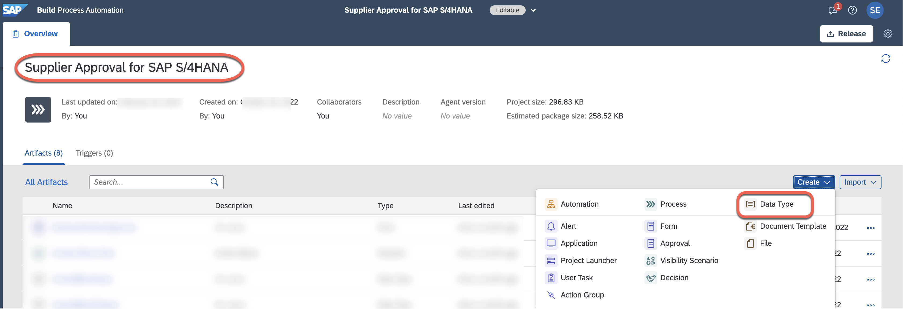

2. In the **Create Data Type** window, do the following:
    - In the **Name** field, choose **CentralBlockInput**.
    - In the **Description** field, choose **Input for Decision**. The value in the **Identifier** field will be automatically filled in.
    - Choose **Create**.

    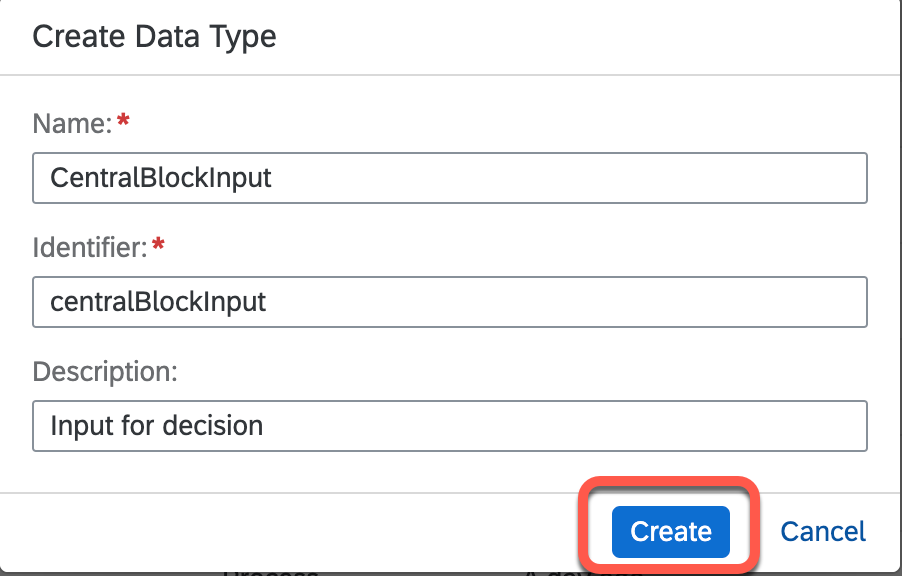

3. In the **CentralBlockInput** data type screen, choose **New Field** to add a new attribute to the data object.

4. In **Field Details** section on the right, in the **Name** field, enter **Country** and in the **Type** dropdown, choose **String**.

5. Choose **Save**.

    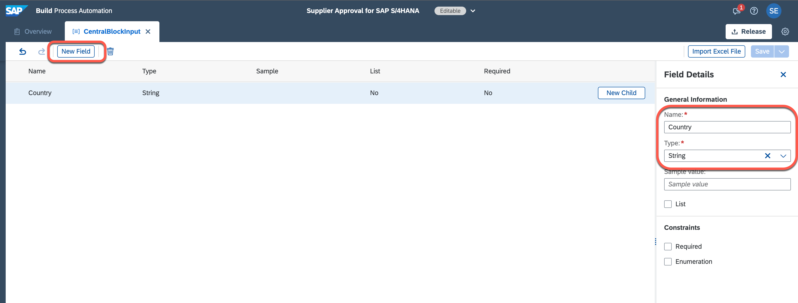

## 2. Create Data Types for Decision Output

An output data type describes the data structure that can be used as an output parameter in an automation, a decision or a process. Data types enable you to formalize the data used as input/output parameters for steps, activities, skills processes, scenarios, triggers, or notifiers. Data types facilitate the manipulation and validation of data.

1. In the **Overview** of **Supplier Approval for SAP S/4HANA** processes, choose **Create** > **Data Type**.

2. In the **Create Data Type** window, do the following:
    - In the **Name** field, choose **CentralBlockOutput**.
    - In the **Description** field, choose **Output for Decision**. The value in the **Identifier** field will be automatically filled in.
    - Choose **Create**.

    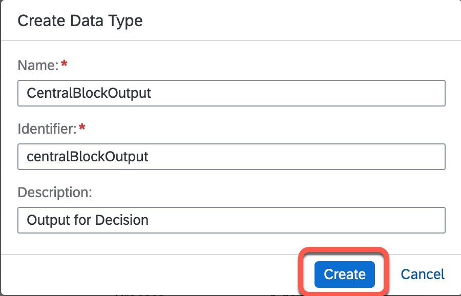

3. In the **CentralBlockOutput** data type screen, choose **New Field** to add a new attribute to the data object.

4. In the **Field Details** section on the right, in the **Name** field, enter **CentralBlock** and in the **Type** dropdown, choose **Boolean**.

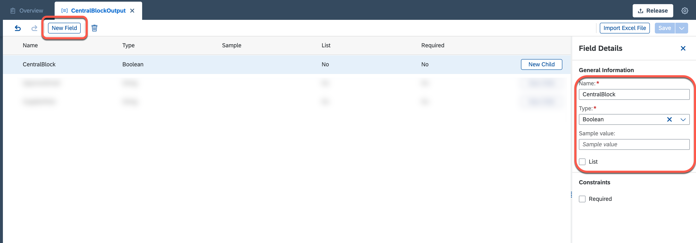

5. In the **Field Details** section on the right, in the **Name** field, enter **ApproverEmail** and in the **Type** dropdown, choose **String**.

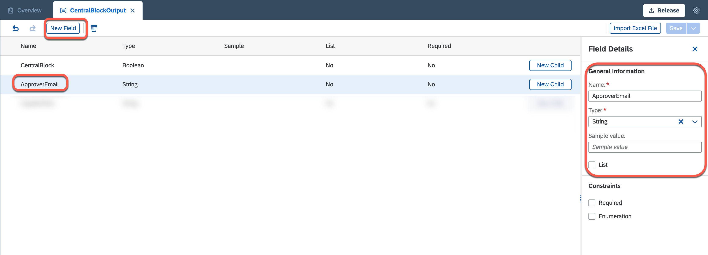

6. In the **Field Details** section on the right, in the **Name** field, enter **SupplierRole** and in the **Type** dropdown, choose **String**.

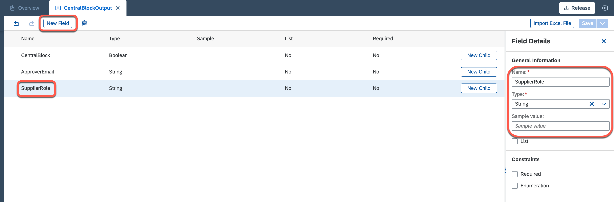

7. Choose **Save**.

## 3. Create Decision

A decision consists of one or more policies. Each policy consists of a collection of rules. They are used to automate the decision-making parts of a business process. After you create a decision, define your business logic by adding rules to the policy. There are two types of rules:
- Decision Table Rule: A decision table is a collection of input and output rule expressions in a tabular representation.
- Text Rule: A text rule is the collection of rule expressions in a simple if-then format.

1. Choose **Create** > **Decision**.

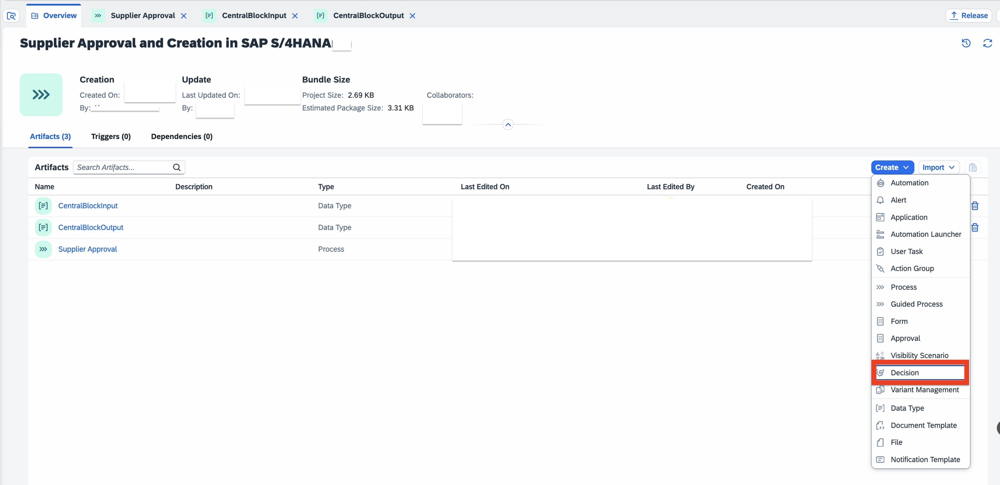

2. In the **Create Decision** window, do the following:
    - In the **Name** field, enter **Central Block Rule**.
    - In the **Description** field, enter **Approver Decision**. 
    - Choose **Create**.

    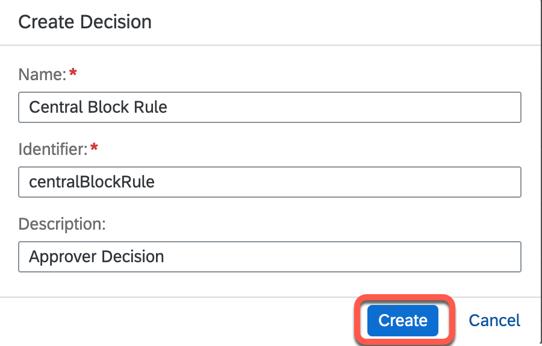

3. In the **Central Block Rule** section, select the **Inputs/Output** tab. 

4. Choose **Add Input Parameter** to configure the input.

5. Configure the input parameter:
    - In the **Name** field, enter **Input**
    - In the **Description** field, enter **input**
    - In the **Type** field, choose **CentralBlockInput**

    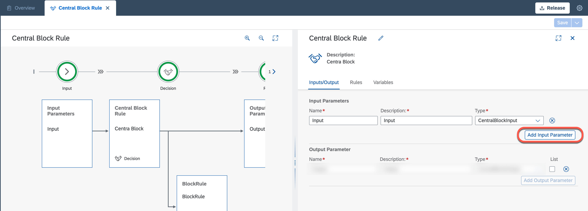

6. Choose **Add Output Parameter** to configure the output.

7. Configure Output Parameter:
    - In the **Name** field, enter **Output**
    - In the **Description** field, enter **output**
    - In the **Type** field, **CentralBlockOutput**

    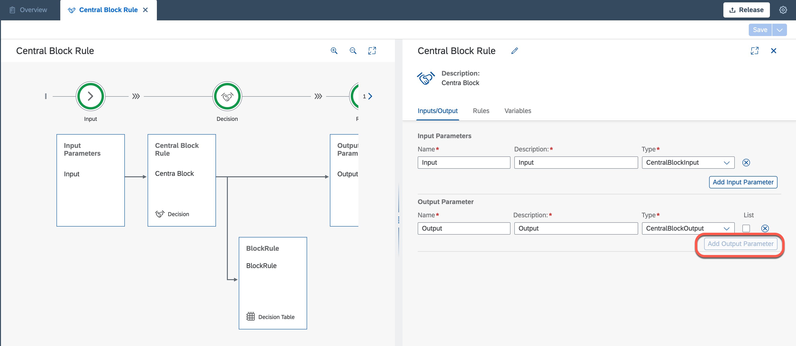

8. Choose **Save**.

9. Then, you will create the actual decision-making parts that make the decision in the process. Under **Central Block Rule**, choose **Rules**.

10. Choose **Add Rule**.

    

11. In the **Create Rule** window:
    - In the **Rule Type** field, select **Decision Table**
    - In the **Rule Name** field, enter **BlockRule**
    - In the **Rule Description** field, enter **BlockRule**
    - Choose **Next Step**. You will be navigated to the **Configure Condition**.

    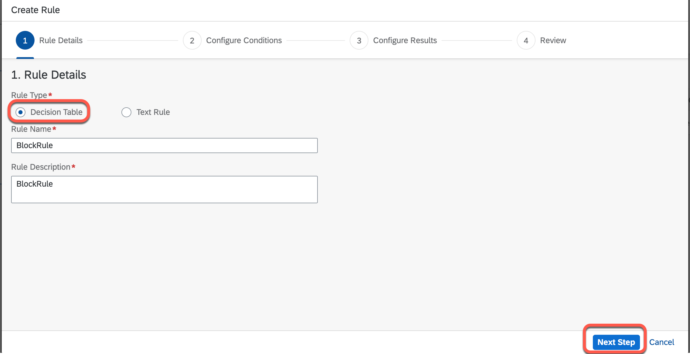

12. You will now configure the conditions. Under **Vocabulary**:
    - Select **country** data type.
    - From the dropdown, choose the input **Country**.
    - In the **Operator (Optional)** dropdown, choose **EXISTIN**.
    - Choose **Next Step**. You will be navigated to the **Configure Results**.

    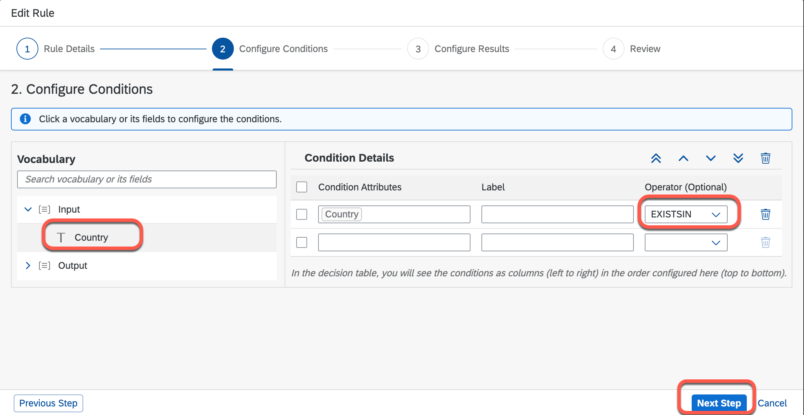

13. Configure the output or result of the decision table. Under Result **Vocabulary**:
    - Choose **Output** data type
    - From the dropdown, choose **Output**
    - Choose **Next Step**.

    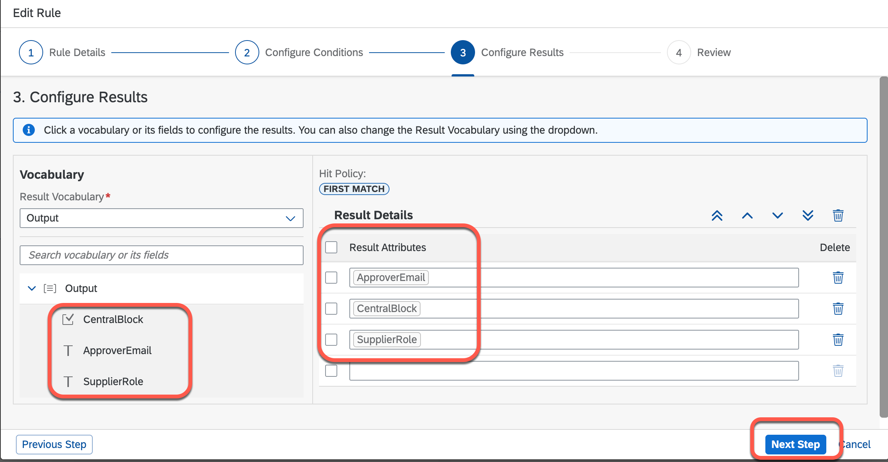

14. Review and choose **Finish** button to create the rule. 
    > In latest release, Finish bitton is renamed as **Create**

    

15. In the newly created **Decision Table**, add values to condition and result columns.

    - Choose **Add Row** > **Insert First**

    - In the **if country.Country EXISTSIN** field, enter **[ 'US' , 'IN' , 'DE' ]**.

    - In the **CentralBlock** field, enter **true**.

    - In the **ApproverEmail** field, enter **'(Your email ID)'**     

    - In the **SupplierRole** field, enter **'FLVN01'**.

    -  Choose **Save**.

    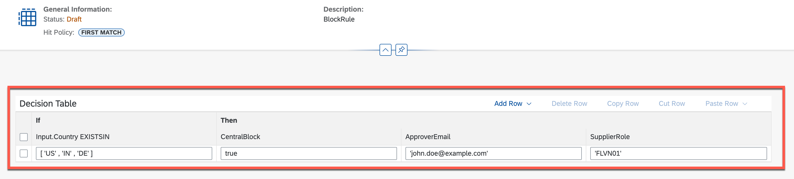

