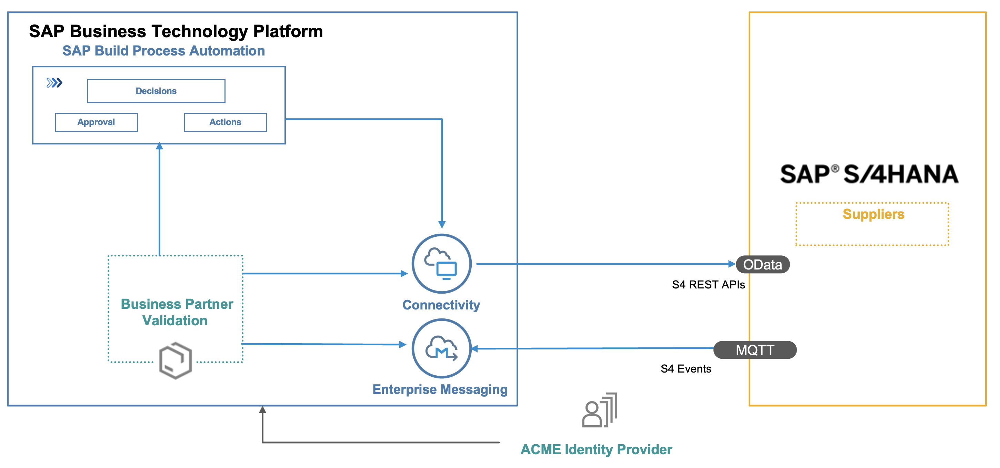

# Learn about the goal and outcome of the mission

The main intent of this scenario is to put an event-driven architecture into action by automating business processes through SAP Build Process Automation and also by building an extension application on SAP Business Technology Platform using SAP Cloud Application Programming Model (CAP) which consumes and further processes the SAP S/4HANA On-premise business events.

This application showcases:

- Building applications on SAP Business Technology Platform (BTP) using [SAP Cloud Application Programming Model(CAP)](../../discover/discover-cap)
- Consuming events from SAP S/4HANA on premise using [SAP Event Mesh](../../discover/sap-event-mesh)
- Consuming REST APIs from SAP S/4HANA on premise using SAP Business Technology Platform Connectivity Service
- [SAP Build Process Automation](../../discover/build-process-automation) (workflow, Forms, desicions, actions )

## Business Scenario

As Supplier Relationship Manager of ACME corporation Jane would like to have a curated mechanism to onboard new suppliers . The newly onboarded suppliers needs to go through multiple validations before ACME starts to do business with the supplier.

A Supplier Relationship executive wants a minimalist form for onboarding new business partner(s). Jane desires to receive an approval notification whenever a new supplier comes onboard. ACME requires the validation of the supplier by iCredible, a third-party business partner validation firm. John, an employee of iCredible, would like to receive notifications when new suppliers are added to the S/4 HANA system of ACME so that he can proceed with the validation process. Once John's verification is complete, Jane wants to receive a notification to approve and unblock payments, as well as the creation of purchase orders for the new supplier.

## Architecture

### Solution Diagram

The Business Partner Validation application is developed using the SAP Cloud Application programming Model (CAP) and runs on the SAP BTP,  Cloud Foundry runtime. It consumes platform services like SAP Event Mesh, SAP HANA and Connectivity. The events occuring in S/4 HANA on premise are inserted into the Event Mesh queue. The application running in Cloud Foundry is notified on events, consumes them from the queue and inserts the event data into the HANA database. The Business Partner Validation Application uses S/4 HANA REST API's to read additional Business Partner Data from the S/4 HANA system.