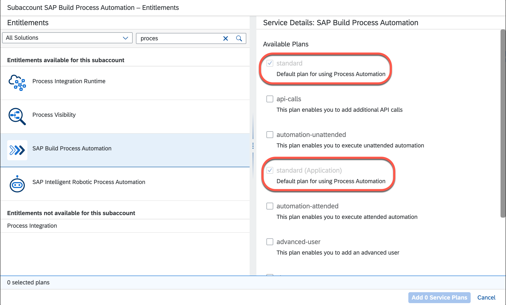

# Prerequisites and Required Systems

This section contains the prerequisites that you have to fulfill before you get started. Make sure that the prerequisites are fulfilled and all required systems, services, and tools are available.

## Systems and Accounts

* [SAP S/4HANA](https://www.sap.com/india/products/s4hana-erp.html) system
* [Global account](https://help.sap.com/products/BTP/65de2977205c403bbc107264b8eccf4b/)
* [SAP S/4HANA Cloud](https://www.sap.com/products/erp/s4hana-erp.html) system
* [Optional] If you don't have an SAP S/4HANA Cloud system you can run this mission by installing a [mock server](../../deploy/setup-mock/README.md).

## Tools

* [Node.js](https://nodejs.org/en/download/) - find the latest Node.js version supported by [CAP](https://cap.cloud.sap/docs/advanced/troubleshooting#node-version).
* [Git](https://git-scm.com/book/en/v2/Getting-Started-Installing-Git)
* [Visual Studio Code](https://code.visualstudio.com/download) or another suitable IDE or editor of your choice
* [kubectl command line tool (kubectl)]( https://kubernetes.io/docs/tasks/tools/install-kubectl-windows/)
* [cds-dk](https://cap.cloud.sap/docs/get-started/)
* (For Windows) [SQLite ](https://sqlite.org/download.html) Find the steps how to install it in the CAP documentation in section [How Do I Install SQLite](https://cap.cloud.sap/docs/advanced/troubleshooting#how-do-i-install-sqlite-on-windows).
* [Docker](https://www.docker.com/products/docker-desktop)
* See section [tools](https://cap.cloud.sap/docs/guides/deployment/deploy-to-kyma#prerequisites) for the other required tools.

## SAP BTP Provider Account

* SAP BTP [subaccount](https://help.sap.com/products/BTP/65de2977205c403bbc107264b8eccf4b/8ed4a705efa0431b910056c0acdbf377.html?locale=en-US#loio8d6e3a0fa4ab43e4a421d3ed08128afa)

### Entitlements

The application requires the following [Entitlements and Quotas](https://help.sap.com/products/BTP/65de2977205c403bbc107264b8eccf4b/00aa2c23479d42568b18882b1ca90d79.html?locale=en-US) in the SAP BTP cockpit:

| Service                           | Plan       | Number of Instances |
|-----------------------------------|------------|:-------------------:|
| SAP HANA Schemas & HDI Containers | hdi-shared |          1          |
| SAP HANA Cloud                    | tools      |          1          |
| Event Mesh                        | default    |          1          |
| Destination Service               |            |          1          |
| Connectivity Service              | proxy      |          1          |
| SAP Build Work Zone, standard edition | standard (Application) |  Subscription       |
| SAP Build Process Automation      | standard   |          1          |
| SAP Build Process Automation      | standard (Application) |  Subscription |

### Configure Entitlements to SAP HANA Cloud and SAP Buiild Process Automation

1. In your SAP BTP Cockpit, choose **Entitlements** and choose **Entity Assignments**, select your sub-account and click **Configure Entitlements**.

   
   
2. Choose **Add Service Plans**.

   
   
3. Search for **hana** and select **SAP HANA Cloud** from the list and select the **hana** checkbox from the Available Plans.

   

4. Search for **Process Automation** and select **SAP Build Process Automation** from the list and choose the **standard** and **standard (Application)**  checkbox from the available plans. 

   
   
5. Choose **Save** to save the changes.

   
