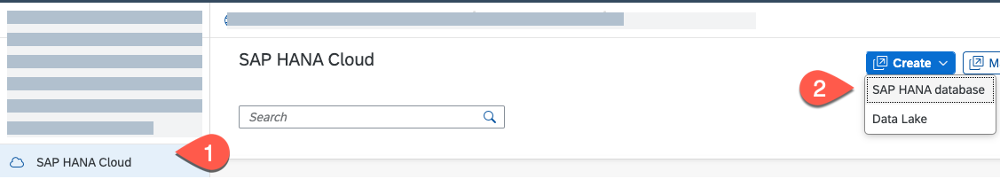

# Create SAP HANA Cloud Service Instance in SAP BTP

### Create a SAP HANA Cloud Service Instance

For this mission, an SAP HANA service for SAP BTP is necessary. Use the following steps create a SAP HANA Cloud instance:

1. In your SAP BTP Cockpit, navigate to your sub-account and to the space which you have created. 
  
2. Choose **SAP HANA Cloud** in the left navigation pane and Choose **Create** and in the drop-down, select **SAP HANA Database**.

    

3. Choose the type of the SAP HANA Cloud Instance as **SAP HANA Cloud, SAP HANA Database** and select **Next Step**.

   
   
4. In the next tab, choose the SAP BTP **Organization** and **Space** from the drop-down box. Enter an **Instance name**, also enter a valid database **Administrator Password** and select **Next Step**.

   

5. Select the **Memory** and **Storage** capacity for your SAP HANA Cloud database instance. For this mission, you can choose the minimum capacity and select **Next Step**.

    
  
6. In the tab for Availability Zone and Replicas, you can leave the defaults and choose **Next Step**. 

       
   
7. In the tab for SAP HANA Advanced Settings, you can leave the default values to **Allow only SAP BTP IP Addresses** and choose **Review and Create**.

   

8. Choose **Create Instance** to create an instance of SAP HANA Cloud Database instance.

    

See section [Create an SAP HANA Database Instance Using SAP HANA Cloud Central](https://help.sap.com/docs/HANA_CLOUD/9ae9104a46f74a6583ce5182e7fb20cb/784a1dbb421a4da29fb1e3bdf5f198ec.html) on SAP Help Portal for more details.

There is a checklist that helps you ensure you have configured properly your global account. See [Getting Started Checklist](https://help.sap.com/viewer/df50977d8bfa4c9a8a063ddb37113c43/Cloud/en-US/cbd76632d8aa4cb7bbf175d7607db463.html).

