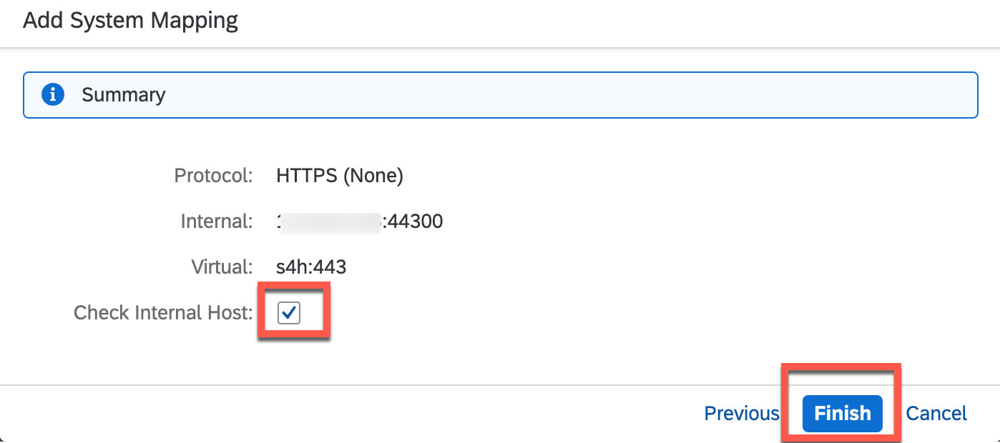
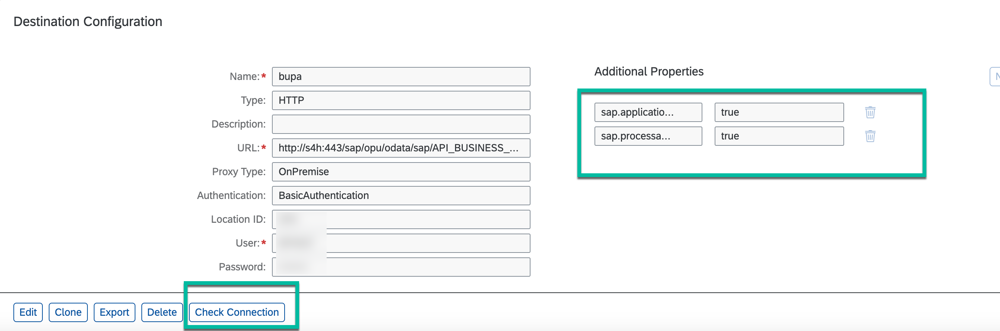
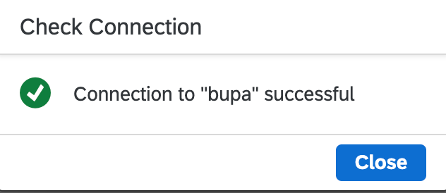

# Set Up Connectivity Between SAP S/4HANA System and SAP BTP

## Introduction

In this section we set up the end-to-end communication between the SAP S/4HANA on-premise system and the SAP Business Technology (SAP BTP) account. To establish it, we have to define an account in SAP Cloud Connector and configure the connection to each system. Then we define a destination on SAP BTP to use this connection setting.

**Personas:** In this section the SAP S/4HANA administrator and the SAP Cloud administrator have to work together.

## Step-by-Step

### **A: Configure End-to-end Connection in Cloud Connector**

1. Get the connection information of your SAP BTP subaccount:
   1. Log on to your SAP BTP subaccount. From the overview page, we need the following environment information.
   2. Subaccount ID.
   3. API Endpoint

   

2. (optional) If you don't want to use the SAP BTP administrator credentials as communication user, you can create a new user with the technical roles for the Cloud Connector. See [Communication User](https://help.sap.com/viewer/cca91383641e40ffbe03bdc78f00f681/Cloud/en-US/daca64dacc6148fcb5c70ed86082ef91.html) for more details.

3. Create a new Connector to your SAP BTP subaccount:
   1. Log in to the Cloud Connector and select the **Connector** entry.
   2. Select **+ Add Subaccount**

   

4. Do the following:
   1. *Region:* Select the region of the API Endpoint of your Subaccount.
   2. *Subaccount:* Enter the ID of your Subaccount.
   3. *Display Name:* The name of this connection which is displayed in your SAP BTP subaccount.
   4. *Subaccount User:* Name of the connection user - for testing you could use your SAP BTP account user, else you first have to create a specific connection user at your SAP BTP account.
   5. *Password:* Password of the connection user
   6. *Description:* Enter a meaningful description.
   7. *Location ID*: Optional field: If you plan to connect more than one Cloud Connector to a subaccount, then you can mention a Location ID. See [Cloud Connector Configuration Help](https://help.sap.com/viewer/cca91383641e40ffbe03bdc78f00f681/Cloud/en-US/db9170a7d97610148537d5a84bf79ba2.html#loiodb9170a7d97610148537d5a84bf79ba2__configure_proxy) for more details.
   8. Click on Save

   

5. Cloud to on-premise setup:
   1. In the added Subaccount, select the **Cloud to On-Premise** tab.
   2. In the **Mapping Virtual to Internal System** section choose the **+** button.

   

6. In the screens of the **Add System** wizard enter the following:

    1. Select **ABAP** and choose **Next**.

    

    2. Select **HTTPS** &rarr; **next**.

    

    3. Enter the host (IP Address or host name) and port of your SAP S/4HANA system. Choose **next**.

    

    4. Enter a virtual host name and port, for example: **s4h**. This will then later used as URL in the destination at your SAP BTP subaccount, choose **Next**.

     ***Hint:** For security reasons it's recommended that the virtual host and port differ from the host and port of the on-premise system*.

    

    5. Choose Principal Type 'None' and press Next - next

    6. For the Host in Request Header select **Use Virtual Host** - next

    

    7. Enter a description for the system mapping - next

    

    8. In the Summary check **Check Internal Host** - click on Finish

    

7. In the resource section press + to add a resource

    

8. Add Resource
   1. Enter the URL root path to the SAP S/4HANA APIs: **/** . Here we are exposing for demo purposes, the root URL exposing all paths but for productive usage, kindly expose only the relevant path from your backend system.
   2. AccessPolicy: set **Path and all sub-paths**.
   3. Enter a description.
   4. Choose **Save**.

   

9. Check the availability of the internal system
    1. In the Access Control tabulator click on **Check availability of internal host**
    2. Status should be green
    3. Check Result should turn to Reachable

     

With this step the on-premise setup is finished.

### **B: Create Destination on SAP BTP**

1. Login to your SAP BTP subaccount
2. Create a new Destination
   1. Open the Connectivity entry and select Destination
   2. Choose **New Destination**

   

3. Setup Destination - enter the following values

    * **Name**:  bupa  --> this destination is later used at the sample application.
    * **Type**:  select HTTP
    * **URL**:  URL of the virtual host that we have exposed in the Cloud Connector in Section A. =  http://\<virtual host\>:\<virtual port\>/sap/opu/odata/sap/API_BUSINESS_PARTNER, in our case it's, http://s4h:443/sap/opu/odata/sap/API_BUSINESS_PARTNER

    * **Proxy Type**: OnPremise
    * **Authentication**: Basic Authentication.
    * **Location ID**: optional field, you have use this field if you connect more than one cloud connectors to your account. See [Destination Configuration Help page](https://help.sap.com/viewer/6d3eac5a9e3144a7b43932a1078c7628/Cloud/en-US/0a2e5a45d5494ec08318ead2019d54db.html).
    * **User**: User name for Basic Authentication
    * **password**: Password for Basic Authentication
    * Under Additional Properties choose `New Property`
    * Enter **sap.applicationdevelopment.actions.enabled**   **true**
    * Enter **sap.processautomation.enabled**  **true**

   

4. Choose **Save** and then select **Check Connection**.

   

   >Troubleshooting: If you receive an error: "Backend status could not be determined" then try to edit and set the Location ID parameter in 'Cloud connector- Configure end-to-end Connection, step 4' above and also give the same Location ID in your destination. Location ID could be any alpha numeric unique identifier in your sub-account. See [Cloud Connector help](https://help.sap.com/viewer/cca91383641e40ffbe03bdc78f00f681/Cloud/en-US/db9170a7d97610148537d5a84bf79ba2.html#loiodb9170a7d97610148537d5a84bf79ba2__configure_proxy) page.

*[See also destination management on SAP BTP](https://help.sap.com/viewer/cca91383641e40ffbe03bdc78f00f681/Cloud/en-US/84e45e071c7646c88027fffc6a7bb787.html)*

## Summary

We have established a secure connection between the SAP S/4HANA on-premise system and the SAP BTP subaccount and we're now ready for building SAP S/4HANA extension on the SAP BTP.

