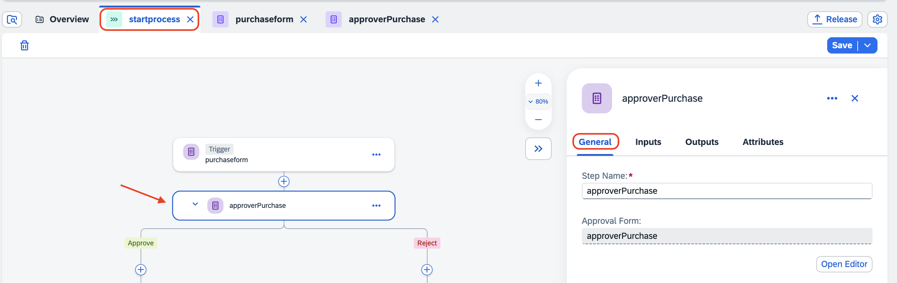

# Create Purchase Order Approval Form.

1. Go back to startprocess tab, and choose **+** after the trigger. 

    

2. Choose Approval

    

3. Choose **Blank Approval**.

    

4. In **Create Approval** Popup
    1. Enter **Name** as **ApprovePurchase**.
    2. Choose **Based on a form**.
    3. Choose the created form name from dropdown

        

5. In **Approval**, choose **Open Editor**.

    

6. Choose **Text** from the layout. In the text box, enter **Status with Comment**.
7. In the Configuration, choose **Required**.
8. Save the Approval.

     

9. Go back to the **startprocess** tab, click on ApprovePurchase, which opens General tab.
    
     

10. Under general tab, do the following:
    1. In the **Subject**, enter 'Approve Purchase Order', and choose the purchase order from purchaseform.
    2. Under the **Recipients** -> **Users**, choose **Process Started By** from Process Metadata.

         

11. In Approval, choose **Inputs** tab.
    1. In **Purchase Order**, choose **purchase order** from the form .
    2. Choose **Save**

         

### You have now completed the development of Approvals.

## Next Step: [Add CAP Nodejs Action inside SPA](../action/README.md)

