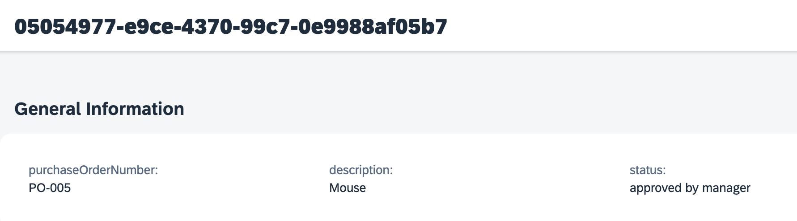

# Test End to End Flow.

## 1. Submit a new PO Approval Form.

1. From the project, choose **process**.

2. Copy Form link from right side, and open in browser.

3. In the form, Choose **Purchase Order** then choose **Submit**.

4. You form is successfully submitted.

## 2. Update Status and Approve the PO.

1. From the lobby, Open **My Inbox**.

2. You will see the task in inbox. In the Approval form, enter approval text in **Start with Comment** field (add some unique description after that).
3. Choose **Approve**.

## 3. Review PO Status in Purchase Order CAP Application.

1. Open [CAP Application](https://hands-on.launchpad.cfapps.eu10.hana.ondemand.com/f1d6d6bf-87c6-480b-8b4e-6ee152fe96aa.purchase.nspurchase-0.0.1/index.html) and filter with your PO. Click **GO**.

2. Review status in detail page as well.

